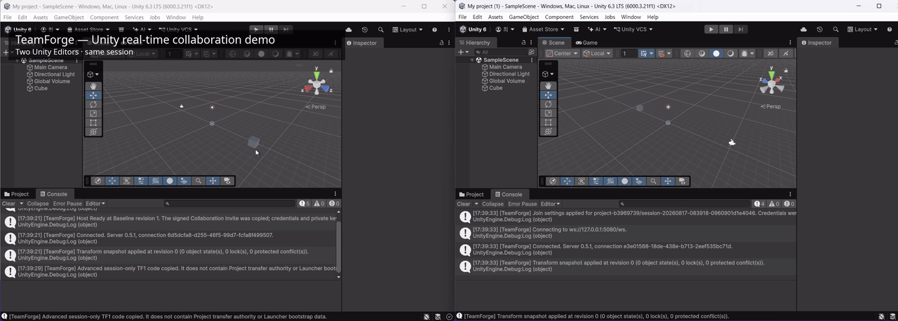

# TeamForge — Unity Editor 실시간 협업

**Build together. Stay in sync.**

*Zero-config first, never zero-control.*

[English](README.md) | **한국어** | **[현재 상태](docs/STATUS.ko.md)** | [변경 기록](CHANGELOG.md) | [로드맵](docs/ROADMAP.ko.md) | [Discussions](https://github.com/Eun-si123/teamforge-unity-collab/discussions) | [기여하기](.github/CONTRIBUTING.md) | [보안](.github/SECURITY.md)

> [!WARNING]
> **초기 공개 프리뷰 — 소스는 공개되어 있지만 일반 설치를 권장하는 단계는 아닙니다.**
>
> TeamForge는 현재 적극적으로 개발 및 안정화 중입니다. 실험 단계의 소스는 테스트, 검토, 보안 피드백 및 기여를 위해 공개되어 있지만, 현재 **중요한 Unity 프로젝트에 일반 사용자가 설치하도록 권장하는 공개 Alpha 패키지는 없습니다.** Backup을 유지하고 TeamForge를 프로젝트 상태의 유일한 사본이나 복구 수단으로 취급하지 마세요.

**TeamForge** *(임시 이름)* 는 **Unity Editor**를 위한 오픈소스 실시간 협업 프로젝트입니다. 여러 사람이 같은 Unity 프로젝트를 작업할 때 **실시간 Scene 변경, 접속자 Presence, 같은 Scene의 Hierarchy 협업, Lock / Ownership, P2P Project bootstrap 및 전송**을 하나의 협업 흐름으로 연결하는 것을 실험합니다.

Release 준비 상태를 판단하기 전에는 **[STATUS.ko.md](docs/STATUS.ko.md)** 를 먼저 확인해 주세요. 현재 구현, 자동 테스트 범위, 아직 Field-blocked인 부분, 공개 설치 경로 전에 통과해야 할 Gate를 구분해서 정리해 두었습니다.

## 데모

두 Unity Editor 인스턴스가 TeamForge로 연결되어 Editor 변경 사항을 실시간으로 공유하는 개발 중 프로토타입 영상입니다. 이 영상은 기능 프로토타입을 보여주는 것이며 Production readiness를 의미하지 않습니다.

## 한눈에 보는 현재 상태

| 영역 | 현재 상태 |
| --- | --- |
| 연결된 사용자 Presence | ✅ 프로토타입 존재 |
| Selection / Editor awareness | ✅ 프로토타입 존재 |
| Transform 동기화 | ✅ 프로토타입 존재 |
| Same-Scene Hierarchy 생성/삭제/이름변경/Reparent/순서 | 🟡 구현 / 안정화 중 |
| Object Lock / Ownership | 🟡 구현 / 안정화 중 |
| Project bootstrap / Collaboration Invite | 🟡 구현 / 안정화 중 |
| Direct P2P Project transfer | 🟡 구현 / 안정화 중 |
| Resume, Integrity check, Staging, Diagnostics, Recovery | 🟡 구현 / 안정화 중 |
| Component / Inspector / Prefab / 일반 Asset 협업 | ⏳ 계획 |
| 일반 사용자용 Packaged Alpha | ⏳ 아직 준비되지 않음 |

현재 검증 상태와 제한사항은 **[STATUS.ko.md](docs/STATUS.ko.md)**, 앞으로의 방향은 **[ROADMAP.ko.md](docs/ROADMAP.ko.md)** 를 참고해 주세요. 로드맵은 출시 날짜나 기능 구현을 보장하는 약속이 아닙니다.

## 개발 기록

TeamForge는 한 번에 만들어진 코드 덤프가 아니라 초기 Editor 연결 프로토타입부터 Presence, Transform/Lock 동기화, P2P Project bootstrap, Hierarchy 동기화와 이후 안정화 작업까지 단계적으로 개발되어 왔습니다.

- **[변경 기록](CHANGELOG.md)** — 버전별 주요 변경 사항을 쉽게 확인하고 상세 Package changelog로 이동할 수 있는 시작점입니다.
- **[Phase 기록](docs/phases/)** — Phase 0부터 Phase 4까지의 개발 기록입니다.
- **[Work-state 기록](docs/work-state/)** — 구현 세션, 디버깅, Hotfix, Decision, Handoff 과정에서 남긴 작업 기록입니다.

일부 Work-state 파일은 원래 내부 Engineering note로 작성되어 표현이 거칠거나 이후 문서에 의해 대체된 부분이 있을 수 있습니다. 프로젝트가 실제로 어떻게 개발되고 문제를 어떻게 추적·수정했는지 확인하기 쉽도록 공개 상태로 유지하고 있습니다.

## 소스 프리뷰

현재 TeamForge 소스는 **테스트, 검토, 보안 피드백 및 기여**를 위해 공개되어 있습니다.

소스 구조는 **[docs/SOURCE.md](docs/SOURCE.md)** 에서 시작할 수 있습니다.

- `unity-package/com.eunsung.teamforge/` — Unity Editor package source와 Editor tests
- `server/` — coordination/session server source와 tests
- `project-peer/` — Project bootstrap / direct-transfer tooling과 tests
- `launcher/` — Launcher source와 tests
- `scripts/` — 개발 및 검증 도구
- `docs/` — Architecture decision, test/release report, engineering note

생성된 Runtime payload, Packaged executable, Local credential, Private key, Machine-specific state는 canonical source에 의도적으로 포함하지 않습니다.

### 공개 저장소가 자동으로 검사하는 것

GitHub Actions는 현재 Server, Project Peer, Launcher runtime-loader, .NET Windows Launcher 경로를 검사합니다. Dependency / Secret / Code scanning 같은 Repository Security automation도 켜져 있습니다.

다만 **Unity EditMode 실행은 아직 필수 공개 GitHub Actions gate가 아니며**, 자동 보안 스캔은 독립적인 보안 감사를 대체하지 않습니다. 자세한 내용은 **[STATUS.ko.md](docs/STATUS.ko.md)** 에 정리되어 있습니다.

## TeamForge를 만들게 된 이유

TeamForge는 처음부터 공개 개발 도구를 만들겠다는 계획으로 시작한 프로젝트가 아닙니다.

저는 친구와 Unity 게임을 만들고 있었고, 어느 순간 **Unity Editor 안에서 좀 더 직접적으로 같이 작업할 수 없을까?** 하는 생각이 들었습니다. 실제로 프로젝트 파일을 계속 주고받고 기다리는 과정을 반복해서 겪어서 시작한 것은 아닙니다. 출발점은 오히려 **두 Unity Editor가 서로 통신하고, 유용한 편집 맥락을 공유하고, 실시간으로 협업할 수 있다면 어떨까?** 라는 호기심에 가까웠습니다.

그 질문에서 TeamForge가 시작됐습니다. 처음에는 공개 제품이라기보다 친구와 제가 언젠가 같이 써볼 수 있는 실험적인 도구에 가까웠습니다.

만들다 보니 이 아이디어가 우리 말고도 유용할 수 있을지 궁금해졌습니다. 친구끼리 만드는 팀, 학생, 소규모 팀, 인디 개발자들은 각자 다른 협업의 불편을 겪을 수 있습니다. 그래서 TeamForge를 다른 사람들도 **소스를 확인하고, 개선하고, 테스트하고, 언젠가 실제로 사용할 수 있는 프로젝트**로 발전시켜 보기로 했습니다.

## 어떤 문제를 해결하려고 하나요?

버전 관리는 매우 유용하며, TeamForge는 **Git, Unity Version Control 또는 다른 Version control / Backup system을 대체하려는 도구가 아닙니다.**

TeamForge는 Unity Editor 안에서 가까이 붙어서 함께 작업할 때 생기는 이런 불편에 집중합니다.

- "지금 어떤 버전의 프로젝트 가지고 있어?"
- "프로젝트 좀 보내줄래?"
- "이 오브젝트 네가 움직였어, 내가 움직였어?"
- "지금 이 Scene 수정 중이야?"
- "왜 네 컴퓨터에서는 되는데 내 컴퓨터에서는 안 되지?"
- 다른 개발자가 작업을 시작하기도 전에 프로젝트 파일을 기다려야 하는 상황

TeamForge는 **실시간 Editor 협업**과 **Project bootstrap / transfer tooling**을 함께 사용해 이런 마찰을 줄일 수 있는지 실험합니다. 동시에 실패, 복구, Identity, Networking, Trust boundary를 숨겨진 “마법”처럼 처리하지 않고 보이게 만드는 것도 중요하게 보고 있습니다.

## 목표로 하는 사용 흐름

장기적으로 일반적인 사용 흐름은 대략 이런 느낌을 목표로 합니다.

1. Unity Project를 엽니다.
2. Start Collaboration을 누릅니다.
3. 다른 개발자를 초대합니다.
4. 초대받은 개발자가 참여에 필요한 Project state를 준비합니다.
5. 두 Editor가 연결됩니다.
6. 유용한 Project / Scene 변경 사항을 계속 수동으로 주고받지 않고 협업 형태로 확인합니다.

이 여섯 단계 안에는 Synchronization, Object identity, Networking, Security, Recovery와 관련된 어려운 문제가 많이 숨어 있습니다. TeamForge는 그 문제들을 실제로 해결할 수 있는지 진지하게 실험하는 프로젝트입니다.

## TeamForge가 아닌 것

현재 TeamForge는 다음과 같은 것이 **아닙니다**.

- Version control이나 Backup을 대체하는 도구
- 완성된 Production collaboration platform
- 일반 사용자에게 설치를 권장하는 완성된 Alpha
- 독립적인 전문 보안 감사를 완료한 Software
- Data loss, malicious peer, implementation mistake, 모든 edge case에 대해 안전성이 보장된 도구
- Roadmap의 모든 항목을 반드시 구현하겠다는 약속

현재 목표는 프로젝트가 모두에게 준비됐다고 주장하는 것이 아니라, **사용 흐름과 기술적 접근이 실제로 가치가 있는지, 그리고 충분히 안전하고 복구 가능하게 만들 수 있는지 먼저 검증하는 것**입니다.

## 중요한 현재 경계

- Same-Scene Hierarchy 기능은 일반적인 Scene / Prefab / Asset 협업보다 범위가 좁습니다.
- 일반 Component / Inspector / Prefab / Asset synchronization은 현재 지원되는 일반 workflow가 아닙니다.
- Persistent server restart recovery는 아직 완성되지 않았습니다.
- 현재 TeamForge는 WebRTC, ICE, STUN, TURN, Relay, 자동 NAT traversal을 제공하지 않습니다.
- 일반 사용자 경로는 Packaged Runtime / Launcher artifact를 기대하지만 이 생성물은 canonical source에 일부러 포함하지 않으므로, 현재 Source Git URL을 **완전한 일반 사용자 설치 경로처럼 홍보하지 않습니다.**

전체 제한사항과 Alpha readiness gate는 **[STATUS.ko.md](docs/STATUS.ko.md)** 에 있습니다.

## 도움을 구하고 있습니다

TeamForge를 만드는 사람과 검증하는 사람이 계속 같은 한 명뿐인 구조로 두고 싶지는 않습니다.

특히 다음과 같은 도움이 유용합니다.

- 🧪 **Disposable project에서 프로토타입을 테스트하고 깨뜨려 보기**
- 🧩 **Unity / C# Review**
- 🌐 **Networking / P2P Review**
- 🔐 **Security Review**
- 📝 **Documentation, UX, Translation**

**[Help wanted: testers, Unity/C# reviewers, networking & security feedback](https://github.com/Eun-si123/teamforge-unity-collab/issues/2)** 또는 **[CONTRIBUTING.md](.github/CONTRIBUTING.md)** 에서 시작할 수 있습니다. 자유로운 질문과 아이디어는 **[GitHub Discussions](https://github.com/Eun-si123/teamforge-unity-collab/discussions)** 를 사용해 주세요.

## 피드백을 받고 싶습니다

이 프로젝트를 일찍 공개하는 이유는 큰 시간을 쓰기 전에 아이디어나 설계가 잘못된 부분을 발견하고 싶기 때문입니다.

예를 들면 이런 피드백이 유용합니다.

- 현재 Unity Project를 어떻게 협업하고 있나요?
- 가장 불편한 부분은 무엇인가요?
- Live Scene / Editor collaboration이 실제로 도움이 될까요?
- Project sharing / bootstrap이 Live editing보다 더 중요한가요?
- 어떤 점 때문에 이런 도구를 사용하지 않을 것 같나요?
- 실제 Project에서 신뢰하려면 무엇이 더 필요할까요?

긍정적인 의견뿐 아니라 **부정적인 의견도 중요합니다.** **[Would you use TeamForge? Early feedback wanted](https://github.com/Eun-si123/teamforge-unity-collab/issues/1)** 에 답하거나 Discussion을 열어 주세요.

## AI 보조 개발 공개

TeamForge는 구현과 문서를 포함해 **AI의 도움을 상당히 많이 받아 개발되고 있습니다.**

저는 숙련된 전문 프로그래머라고 자신을 소개하지 않습니다. 모든 코드를 직접 손으로 작성하거나 전문적으로 리뷰했다고 오해받고 싶지도 않습니다. 제가 하는 일에는 Product goal과 Workflow 정의, 구현 방향 지시와 평가, 실제 환경 실행, Bug reproduction, Failure case 수집, Automated / Manual test, 최종 Project decision이 포함됩니다.

하지만 이런 과정은 경험 많은 독립적인 Review를 대체하지 않습니다. Architecture 문제, Race condition, Security issue, Data-loss scenario, Edge case를 모두 발견한다고 보장할 수 없습니다.

AI-assisted contribution도 허용하지만 제출자는 결과를 실제로 검토하고 테스트하며 책임져야 합니다. 자세한 내용은 **[CONTRIBUTING.md](.github/CONTRIBUTING.md)** 를 확인해 주세요.

## 안전과 보안

현재 TeamForge Build는 모두 실험적인 Software로 취급해 주세요.

- Backup을 유지합니다.
- 초기 테스트에는 Disposable project를 권장합니다.
- 동작과 Compatibility가 바뀔 수 있다고 예상합니다.
- Credential, Access token, Invite secret, Sensitive data를 Log에 공개하지 않습니다.
- 모르는 Fork나 Build는 신뢰할 근거가 생기기 전까지 Untrusted로 취급합니다.

보안에 민감한 제보는 **[SECURITY.md](.github/SECURITY.md)** 를 따르고, GitHub Private Vulnerability Reporting을 사용할 수 있다면 민감한 제보에는 그 방식을 우선해 주세요.

## 오픈소스 방향과 라이선스

TeamForge는 **GNU Affero General Public License version 3 (AGPLv3)** 로 공개되는 오픈소스 프로젝트입니다. 현재 실험 소스는 공개되어 있지만 Packaged public alpha 배포는 아직 준비 상태 단계입니다.

AGPLv3를 선택한 이유 중 하나는 TeamForge가 Networking software이기 때문에 수정된 covered version도 검토 가능한 상태로 남기를 원하기 때문입니다. 하지만 Open source라는 사실만으로 특정 Build가 안전해지는 것은 아닙니다.

**TeamForge는 [Eun-si123](https://github.com/Eun-si123) / BlackProtogen이 처음 구상하고 시작한 프로젝트입니다.** 이후 Contributor와 Fork는 각자의 작업에 대해 적절한 Credit을 받아야 합니다.

실제 License / Attribution 조건은 **[LICENSE](LICENSE)**, **[NOTICE](NOTICE)**, **[AUTHORS.md](AUTHORS.md)** 를 확인해 주세요.

## 저장소 안내

| 문서 | 용도 |
| --- | --- |
| [STATUS.ko.md](docs/STATUS.ko.md) | 현재 기능, 검증 상태, 제한사항, Alpha readiness gate |
| [CHANGELOG.md](CHANGELOG.md) | 버전별 주요 변화와 상세 개발 기록으로 이동하는 시작점 |
| [docs/phases/](docs/phases/) | Phase 0–4 개발 기록 |
| [docs/work-state/](docs/work-state/) | 구현, 디버깅, 안정화 과정의 원본에 가까운 작업 기록 |
| [docs/SOURCE.md](docs/SOURCE.md) | Public source tree와 Review 시작점 |
| [ROADMAP.ko.md](docs/ROADMAP.ko.md) | 개발 방향과 향후 작업 |
| [CONTRIBUTING.md](.github/CONTRIBUTING.md) | 테스트, 리뷰, 문서, 기여 방법 |
| [SECURITY.md](.github/SECURITY.md) | 보안 기대사항 및 취약점 제보 |
| [SUPPORT.md](.github/SUPPORT.md) | 질문 / 문제 종류에 따른 제보 위치 |
| [AUTHORS.md](AUTHORS.md) | 프로젝트 시작 및 Contributor Credit |
| [NOTICE](NOTICE) | AGPLv3와 함께 제공되는 Attribution / Origin 안내 |
| [LICENSE](LICENSE) | GNU AGPLv3 License text |

## 개발 속도

TeamForge는 **개인 오픈소스 프로젝트이며 회사가 지원하는 Full-time Product가 아닙니다.** 학교, 휴식, 친구, 게임, 다른 취미, 일상생활 때문에 개발 속도가 느려지거나 잠시 멈출 수 있습니다.

조용한 기간이 있다고 해서 **자동으로 Project가 abandon되었다는 뜻은 아닙니다.** 지속 불가능한 속도를 약속하기보다 오래 유지할 수 있는 속도로 만드는 편을 선호합니다.

## 프로젝트 상태

🛠️ **Active development / Early validation**

현재 우선순위는 일반 설치를 홍보하거나 기능 수를 빠르게 늘리는 것이 아니라, 기존 Collaboration / Transfer / Diagnostics / Security / Recovery 기반을 더 신뢰할 수 있게 만드는 것입니다.

일찍 이 저장소를 발견했다면 반갑습니다 👋

Feedback, Skepticism, Bug report, Testing, Code review, Security criticism, Suggestion 모두 환영합니다.