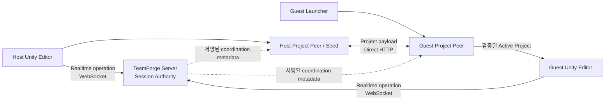

# TeamForge는 어떻게 동작하나요?

이 문서는 **Host가 협업을 시작하고, Guest가 참가하고, 프로젝트가 전송되고, Scene 편집이 다른 PC에 반영되고, 연결이 끊기거나 실패했을 때 TeamForge 내부에서 어떤 일이 벌어지는지** 설명한다.

완전한 프로토콜 명세나 소스 파일 목록이 아니라, 전체 흐름을 이해하기 위한 설명서다.

- 현재 실제로 지원되거나 막혀 있는 기능은 [STATUS.ko.md](STATUS.ko.md)를 본다.
- 현재 구현된 구조와 Trust Boundary는 [architecture.md](architecture.md)를 본다.
- 실제 코드가 어느 파일에 있는지는 [CODEMAP.md](../CODEMAP.md)를 본다.
- 왜 특정 설계를 선택했는지는 [architecture-decisions.md](architecture-decisions.md)를 본다.

## 60초 만에 보는 전체 구조

TeamForge에는 현재 의도적으로 분리된 두 가지 데이터 경로가 있다.



핵심은 다음과 같다.

- **Realtime authority**는 TeamForge Server를 통과한다.
- **프로젝트 파일의 실제 바이트**는 Project Peer끼리 직접 이동한다.
- Server는 프로젝트 관련 metadata를 조정하지만 정상 프로젝트 파일 relay가 되지는 않는다.
- Guest는 받은 파일의 신뢰, 무결성, activation, Unity handoff 검증이 끝나기 전에는 프로젝트를 정상 Active Project로 취급하지 않는다.

이렇게 분리하면 큰 프로젝트 파일 전송이 지연에 민감한 realtime collaboration traffic을 방해하는 것을 줄이면서, realtime authority는 한 군데에 명확하게 유지할 수 있다.

## 주요 프로세스의 역할

### Unity Editor Package

Unity Package는 사용자가 직접 보는 Editor 쪽 TeamForge다. Host flow, realtime connection lifecycle, Presence, 지원되는 Transform/Lock과 same-Scene Hierarchy 협업, diagnostics/recovery UI, 승인된 remote state를 Scene에 적용하는 작업을 맡는다.

Unity Client는 **authority를 관찰하고 적용한다.** 어떤 값이 한 Editor에 존재한다고 해서 그 값이 자동으로 공유 상태의 진실이 되는 것은 아니다.

### TeamForge Server

Server에는 서로 다른 두 역할이 있다.

1. **Session Authority** — 참가자, shared revision/order, lock/lease, 지원되는 Scene state, replay/idempotency 보호, realtime effect.
2. **Project Coordinator** — Project/Publisher/Baseline/Peer 관련 서명된 coordination metadata.

Server는 정상 프로젝트 Manifest/File/Chunk payload를 저장하거나 relay하지 않는다.

### Project Peer

Project Peer는 프로젝트 bootstrap과 transfer를 맡는다. Signed Invite 검증, deterministic manifest/hash, Direct HTTP transfer, 검증된 resume, staging, immutable Active revision, filesystem/path safety, Project/Publisher trust 확인이 여기에 포함된다.

네트워크 다운로드에 성공했다고 바로 프로젝트가 활성화되는 것은 아니다. 전체 verification/trust/activation 절차를 통과해야 한다.

### Windows Guest Launcher

Fresh Guest는 아직 열 Unity Project가 없을 수 있으므로 Unity 밖의 Launcher에서 시작한다. Launcher는 bundled TeamForge Runtime을 검증하고, Invite와 trust 상태를 확인하고, Project Peer를 통해 프로젝트를 받은 뒤, 최종 Active Project와 필요한 Unity 버전을 검증하고 Unity로 handoff한다.

정상 packaged Guest는 system Node.js/npm을 직접 설치하거나 Project Peer CLI를 수동으로 다룰 필요가 없다.

문제 분석이 필요할 때 현재 Launcher source는 사용자가 직접 **로컬 Support Bundle을 저장**할 수도 있다. 이 ZIP은 제한된 범위의 redacted 관찰 자료이며 자동 업로드되지 않는다. 또한 Authority를 부여하거나 Invite/Trust/Activation/Runtime/Path/Unity handoff 검증을 우회하지 않는다. 특정 Packaged Candidate에 이 기능이 실제로 포함되는지는 그 Artifact가 어떤 Source에서 빌드됐는지에 따라 달라지므로 [STATUS.ko.md](STATUS.ko.md)와 [../builds/README.md](../builds/README.md)에서 현재 Source와 Published Package 경계를 확인한다.

## Host가 협업을 시작하면 무슨 일이 일어나나

큰 흐름은 이렇다.

```text
Host가 Publish & Start 선택
        ↓
Unity Host flow가 로컬 Project / 저장된 Scene 전제조건 확인
        ↓
Project Peer가 deterministic project baseline 준비
        ↓
File / Chunk에 integrity identity 생성
        ↓
Host Project Peer가 Direct Transfer Seed 시작
        ↓
Server와 Project / Publisher / Baseline / Peer metadata 조정
        ↓
Signed Collaboration Invite 생성
        ↓
Host Ready
```

실제 구현에는 더 많은 fail-closed 검사가 있지만 중요한 점은 **Host Ready가 단순히 “포트가 하나 열렸다”는 뜻이 아니라는 것**이다. Guest가 사용할 Project Transfer와 realtime session 계약이 필요한 수준까지 준비되었다는 뜻이다.

Collaboration Invite에는 access code, private signing key, 임의의 로컬 Project 절대 경로를 넣는 것을 의도하지 않는다. Access code를 사용하는 경우 별도로 공유한다.

## Fresh Guest가 참가하면 무슨 일이 일어나나

Guest flow는 일부러 여러 단계로 나뉜다.

```text
Windows Guest Launcher 실행
        ↓
Bundled TeamForge Runtime 검증
        ↓
Collaboration Invite 입력 / 열기
        ↓
Invite 구조와 signature 검증
        ↓
Project / Owner / Publisher identity와 trust 확인
        ↓
조정된 Host / Seed에 연결
        ↓
Descriptor / Manifest / Inventory 확인
        ↓
필요한 Project Chunk만 수신
        ↓
Chunk / File / Manifest / Project integrity 검증
        ↓
Staging에 Project 구성
        ↓
완성된 Candidate Project 전체 검증
        ↓
Immutable Active Revision 생성
        ↓
작은 current-project pointer만 이동
        ↓
필요한 Unity executable과 최종 handoff 검증
        ↓
검증된 Project를 Unity에서 열기
```

TeamForge는 다운로드 중인 임의의 디렉터리를 곧바로 현재 프로젝트로 취급하지 않는다. 새 revision을 받는 중이거나 activation이 실패해도 이전에 검증된 Active revision을 보존할 수 있다.

### Resume도 검증을 우회하지 않는다

전송이 중간에 끊기면 transfer contract가 허용하는 범위에서 이미 검증된 content를 재사용할 수 있다. 하지만 “디스크에 파일이 있으니까 믿는다”는 뜻은 아니다. Hash와 activation contract가 계속 기준이다.

## 지원되는 Scene Object를 움직이면 무슨 일이 일어나나

Transform 예를 단순화하면 다음과 같다.

```text
사용자가 지원되는 GameObject 이동
        ↓
Unity Transform Service가 로컬 변경 감지
        ↓
Authority-canonical Object identity 해결
        ↓
Lock / Lease와 현재 connection authority 확인
        ↓
Realtime WebSocket으로 Transform operation 전송
        ↓
Server Session Authority가 operation 검증
        ↓
Ordering / Revision / Idempotency 규칙 적용
        ↓
승인된 effect를 다른 Client에 전파
        ↓
Remote Client의 Authority View 갱신
        ↓
Unity가 승인된 Remote Transform을 안전하게 적용
```

이 때문에 TeamForge 전반에 몇 가지 개념이 반복해서 등장한다.

### Identity

두 Editor가 단순히 이름이 같은 Object가 아니라 **같은 논리적 Object**를 가리켜야 한다. 저장된 Scene Object는 안정적인 Unity identity를 baseline identity로 사용하고, 지원되는 session-created Object는 authoritative binding 이후 TeamForge logical identity를 사용할 수 있다.

Identity가 애매하면 이름, sibling index, Hierarchy path로 몰래 추측하지 않고 fail closed한다.

### Authority

공유 realtime state의 승인 여부는 Server가 결정한다. Client는 intent를 보내고 승인된 결과를 적용한다. 각 Client가 서로 다른 독립적인 진실을 유지하는 구조가 아니다.

### Revision과 Ordering

승인된 operation은 공유 authority ordering을 진행시킨다. Revision은 stale state, late join, replay, 현재 operation이 예상된 shared state를 기준으로 평가되었는지 판단하는 데 쓰인다.

### Lock / Lease

지원되는 편집은 authority-controlled lock/lease를 사용해 두 사용자가 같은 Object를 조용히 덮어쓰는 상황을 줄인다. Client가 사라졌을 때 lock이 영구적으로 남지 않도록 lease는 만료된다.

### Replay / Idempotency

Network Client는 retry할 수 있다. 따라서 TeamForge는 같은 operation의 정상적인 재전송과, 다른 operation이 identity를 재사용하려는 경우를 구분해야 한다. 같은 메시지가 두 번 도착했다는 이유만으로 shared state를 두 번 변경하면 안 된다.

## Hierarchy 변경

지원되는 same-Scene create/delete/rename/reparent/sibling-order 변경은 평범한 Transform처럼 취급하지 않고 별도의 authoritative Hierarchy 경로를 사용한다.

Hierarchy authority가 중요한 이유는 Transform이 Object 구조에 상대적이기 때문이다. 두 Peer가 parent나 identity에 대해 서로 다른 상태라면 똑같은 local Transform 숫자를 적용해도 서로 다른 Scene이 될 수 있다.

현재 지원되는 Hierarchy subset을 근거로 일반 Component/Inspector/Prefab/Asset synchronization이나 임의의 cross-Scene 구조 협업까지 지원한다고 추측하면 안 된다. 최신 범위는 [STATUS.ko.md](STATUS.ko.md)를 본다.

## Reconnect와 Connection Epoch

Reconnect했다고 해서 이전 Client authority가 자동으로 여전히 유효하다고 보지 않는다.

개념적으로는 다음과 같다.

```text
Connection 끊김
    ↓
Connection-scoped authority 신뢰 중지
    ↓
Reconnect / Handshake
    ↓
현재 capability와 authoritative state 수신
    ↓
새 connection epoch에서 지원되는 Object authority 재결합
    ↓
필요한 state가 준비된 뒤 정상 협업 재개
```

Persisted alias나 local cache identity가 resolution에 도움은 될 수 있지만 reconnect 뒤에 스스로 authority를 부여하지는 않는다.

## 실패와 복구

TeamForge는 알 수 없는 상태를 강제로 통과시키기보다 검증된 상태를 보존하려는 방향으로 동작한다.

예를 들면:

- Runtime 손상 → 검증되지 않은 packaged code 실행 전에 중단;
- 잘못되거나 충돌하는 Invite → 기존 Project binding을 그대로 유지;
- Transfer 실패 → 허용되는 범위에서 검증된 reusable progress 보존;
- Activation 실패 → 이전 verified Active Project를 교체하지 않음;
- Unity Path 문제 → 별도로 검증된 TeamForge-owned path-resilience 방식만 사용;
- Baseline/Identity mismatch → 임의 추측 대신 reconciliation/update 요구;
- 필요한 Port를 모르는 Process가 사용 중 → TeamForge가 필요하다는 이유만으로 그 Process를 종료하지 않음.

따라서 Recovery Action은 **현재 상태에 따라 결정된다.** Retry, Paste New Invite, Use Latest Project, Open Existing Verified Project, Choose Unity 같은 Action은 안전한 의미가 정의된 상태에서만 제공하는 것을 목표로 한다.

**Diagnostics는 관찰 자료이지 Recovery Authority가 아니다.** Copy diagnostics와 Manual Support Bundle은 현재 실행 상태를 사용자나 Bug report에 설명하는 데 도움을 준다. Bundle을 저장한다고 Project 선택이 바뀌거나 Operation이 재시도되거나 Publisher가 Trust되거나 Content가 Activate되거나 Safety check가 완화되지 않는다. Support Bundle은 광범위한 Project/Machine dump 대신 제한된 Safe-state 정보만 수집하도록 설계되어 있고, 공개 공유 전에는 여전히 사용자가 내용을 검토하는 것이 좋다.

## Project Transfer와 Realtime Collaboration을 왜 분리했나

모든 것을 하나의 Server와 Socket에 넣는 설계도 가능하다. 현재 TeamForge는 일부러 그렇게 하지 않는다.

Realtime collaboration은 작은 ordered authority message에 적합하다. 반대로 Project bootstrap은 많은 파일, 큰 byte stream, retry/resume, hashing, staging, disk work를 포함할 수 있다. 둘을 분리하면 Project payload가 숨겨진 Server 병목이 되는 것을 피하고 보안/실패 경계도 더 명확히 생각할 수 있다.

대신 Host Project Peer가 Guest에서 실제로 도달 가능해야 한다는 trade-off가 있다. 현재 Direct Transfer는 same-PC, reachable LAN, managed VPN 환경에 맞는다. 자동 Internet discovery/NAT traversal/relay는 별도의 미래 transport 문제이며 `P2P`라는 단어만으로 현재 지원된다고 보면 안 된다.

## State는 어디에 얼마나 오래 남나

모든 TeamForge state의 lifetime이 같지는 않다.

| State | 현재 Lifetime / Owner |
| --- | --- |
| Realtime Session Authority | Live Session 동안 Server memory |
| Project coordination registry | Server memory |
| Client Authority View | 현재 Unity connection |
| Project transfer content / staging | Managed Project Peer storage |
| Verified Active Project revision | Durable managed Project storage |
| Current Active pointer | 작은 durable metadata pointer |
| Launcher diagnostics history | 제한된 current-run history |
| 사용자가 저장한 Support Bundle | 로컬의 제한된/redacted ZIP, 자동 업로드 없음 |

이 차이는 Server restart, reconnect, Project resume, recovery를 이해할 때 중요하다. 다운로드된 Project가 durable하다고 해서 realtime authority history까지 durable하다는 뜻은 아니며, 저장된 Diagnostic Artifact가 Collaboration Authority의 일부가 되는 것도 아니다.

## 실제 Source까지 따라가고 싶다면

이 문서로 **무슨 일이 일어나는지** 이해한 뒤 **어느 코드가 그 일을 하는지** 보고 싶다면 [CODEMAP.md](../CODEMAP.md)로 이어가면 된다.

대표적인 흐름은 다음과 같다.

- realtime connection → Unity `TeamForgeConnectionService` + Server WebSocket host;
- Transform/Lock → Unity Transform Service + Authority View + Server Session Authority;
- Hierarchy → Unity Hierarchy Service + Server Hierarchy Model / Session Authority;
- Project bootstrap/transfer → Project Peer Host/Guest Orchestrator + Direct Transfer Source + Content Store;
- Guest startup/recovery → Windows Launcher + Launcher Core + Guest Orchestrator;
- Support diagnostics → Launcher Diagnostics UI + Launcher Core Support Bundle / Redaction path;
- Path resilience → Launcher Core + shared Project Peer path-resilience contract.

정확한 파일 이름과 테스트 위치는 이 문서에 다시 복제하지 않고 CODEMAP이 소유하게 한다. 그래야 구현 파일이 refactor되어도 이 설명서는 전체 동작을 이해하는 문서로 오래 유지할 수 있다.
