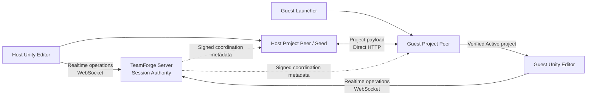

# How TeamForge works

This page explains **what happens inside TeamForge when a person hosts, joins, transfers a project, edits a Scene, disconnects, or recovers from a failure**.

It is intentionally a guided explanation rather than a complete protocol specification or source-code map.

- For the current supported/blocked feature set, use [STATUS.md](STATUS.md).
- For the authoritative as-built topology and trust boundaries, use [architecture.md](architecture.md).
- For file-level implementation navigation, use [CODEMAP.md](../CODEMAP.md).
- For why important design choices were made, use [architecture-decisions.md](architecture-decisions.md).

## The 60-second model

TeamForge currently has two deliberately separate data paths:



The important separation is:

- **Realtime authority** goes through the TeamForge Server.
- **Project file payload bytes** move directly between Project Peers.
- The Server coordinates project metadata but does not become the project-file relay.
- The Guest does not open received content until trust, integrity, activation, and Unity-handoff checks pass.

That separation keeps large project transfer away from latency-sensitive collaboration traffic while leaving one clear realtime authority.

## The main processes

### Unity Editor package

The Unity package is the Editor-facing part of TeamForge. It provides the Host flow, realtime connection lifecycle, Presence, supported Transform/Lock and same-Scene Hierarchy collaboration, diagnostics/recovery presentation, and the application of approved remote state to the local Scene.

The Unity client **observes authority**. A local Scene value does not become authoritative merely because it exists in one Editor.

### TeamForge Server

The Server has two distinct responsibilities:

1. **Session Authority** — membership, shared revision/order, locks/leases, retained supported Scene state, replay/idempotency protection, and realtime effects.
2. **Project Coordinator** — signed project/publisher/baseline/peer coordination metadata.

The Server does not store or relay the normal project Manifest/File/Chunk payload.

### Project Peer

Project Peer owns project bootstrap and transfer behavior: signed invite validation, deterministic manifests and hashes, direct HTTP transfer, verified resume, staging, immutable Active revisions, filesystem/path safety, and project/publisher trust checks.

A successful network download is not enough to activate a project. Content still has to pass the complete verification and trust path.

### Windows Guest Launcher

A fresh Guest starts outside Unity because there may be no Unity project to open yet. The Launcher verifies its bundled TeamForge Runtime, checks the invite and trust state, receives the project through Project Peer, validates the final Active project and required Unity version, then hands off to Unity.

Normal packaged Guests do not need to install or manually operate system Node.js/npm.

For troubleshooting, current Launcher source can also create a **manual local support bundle**. That ZIP is a bounded/redacted observation artifact; it is not uploaded automatically, does not grant authority, and does not bypass invite, trust, activation, Runtime, path, or Unity-handoff validation. Whether a packaged candidate contains that action depends on the exact artifact that was built; [STATUS.md](STATUS.md) and [../builds/README.md](../builds/README.md) distinguish current source from published packages.

## What happens when the Host starts collaboration

At a high level:

```text
Host chooses Publish & Start
        ↓
Unity Host flow checks the local project / saved Scene prerequisites
        ↓
Project Peer prepares a deterministic project baseline
        ↓
Files and chunks receive integrity identities
        ↓
Host Project Peer starts the direct transfer Seed
        ↓
Project / publisher / baseline / peer metadata is coordinated with the Server
        ↓
TeamForge creates a signed Collaboration Invite
        ↓
Host becomes ready for Guests
```

The exact implementation contains additional fail-closed checks, but the important user-visible idea is that **Host Ready means more than “a port opened.”** TeamForge has established the project-transfer and realtime-session contracts needed by the Guest flow.

The Collaboration Invite is not intended to carry the access code, private signing key, or arbitrary local project path. The access code, when used, is shared separately.

## What happens when a fresh Guest joins

The Guest flow is deliberately staged:

```text
Open Windows Guest Launcher
        ↓
Verify bundled TeamForge Runtime
        ↓
Load / paste Collaboration Invite
        ↓
Validate invite structure and signature
        ↓
Inspect Project / Owner / Publisher identity and trust
        ↓
Contact the coordinated Host / Seed
        ↓
Receive descriptor / manifest / inventory information
        ↓
Download only required project chunks
        ↓
Verify chunk, file, manifest and project integrity
        ↓
Build in staging
        ↓
Verify complete candidate project
        ↓
Create immutable Active revision
        ↓
Move the small current-project pointer
        ↓
Validate required Unity executable and final handoff
        ↓
Open the verified project in Unity
```

TeamForge intentionally avoids treating an arbitrary partially downloaded directory as the current project. The previous verified Active revision can remain available while a newer revision is being received or if activation fails.

### Resume is verification-aware

When transfer is interrupted, TeamForge can reuse already verified content where the transfer contract allows it. Reuse does not mean “trust whatever file happens to be on disk”; hashes and the activation contract remain authoritative.

## What happens when someone edits a supported Scene object

A simplified Transform example looks like this:

```text
User moves a supported GameObject
        ↓
Unity Transform service observes the local change
        ↓
Resolve the authority-canonical object identity
        ↓
Check lock / lease and current connection authority
        ↓
Send a Transform operation over the realtime WebSocket
        ↓
Server Session Authority validates the operation
        ↓
Server applies ordering / revision / idempotency rules
        ↓
Approved effect is broadcast to the other clients
        ↓
Remote client updates its observed Authority View
        ↓
Unity applies the approved remote Transform safely
```

This is why several concepts appear throughout TeamForge.

### Identity

Two Editors need to mean the **same logical object**, not merely two objects that happen to have the same name or Hierarchy path. Saved Scene objects use stable Unity identity as their baseline identity, while supported session-created objects can receive TeamForge logical identity after authoritative binding.

Ambiguous identity fails closed rather than silently guessing by name, sibling index, or path.

### Authority

The Server decides the accepted shared realtime state. Clients report intent and apply accepted results; they do not each maintain an independent competing truth.

### Revision and ordering

Accepted operations advance shared authoritative ordering. Revision information lets clients reason about stale state, late joins, replay, and whether an operation was evaluated against the expected shared state.

### Lock / lease

Supported edits use authority-controlled locking/leases so two users do not silently overwrite the same object at the same time. Leases expire rather than becoming permanent locks when a client disappears.

### Replay / idempotency protection

Network clients can retry. TeamForge therefore distinguishes a legitimate retry of the same operation from a different operation attempting to reuse an identity. A retry must not mutate shared state twice merely because the message was delivered twice.

## Hierarchy changes

Supported same-Scene create/delete/rename/reparent/sibling-order changes use a separate authoritative Hierarchy path rather than pretending they are ordinary Transform changes.

Hierarchy authority is important because a Transform is relative to object structure. If two peers disagree about parentage or identity, applying identical local Transform numbers can still produce different Scenes.

General Component/Inspector/Prefab/Asset synchronization and arbitrary cross-Scene structure must not be inferred from the currently supported Hierarchy subset. Check [STATUS.md](STATUS.md) for the current boundary.

## Reconnect and connection epochs

A reconnect is not treated as proof that old client authority is still current.

Conceptually:

```text
Connection lost
    ↓
Stop trusting connection-scoped authority
    ↓
Reconnect / handshake
    ↓
Receive current negotiated capabilities and authoritative state
    ↓
Re-bind supported object authority for the new connection epoch
    ↓
Resume normal collaboration only after required state is ready
```

Persisted aliases or local cached identities may help resolution, but they do not grant authority by themselves after reconnect.

## Failure and recovery

TeamForge tries to preserve verified state instead of “forcing through” an unknown state.

Examples:

- damaged Runtime → stop before executing unverified packaged code;
- invalid or conflicting invite → keep the existing project binding unchanged;
- transfer failure → preserve verified reusable progress where allowed;
- activation failure → do not replace the previous verified Active project;
- Unity path problem → use only a separately validated TeamForge-owned path-resilience strategy;
- baseline/identity mismatch → require reconciliation/update rather than silently guessing;
- unknown process on a required port → do not kill it just because TeamForge wants the port.

Recovery actions are therefore **state-driven**. A Retry, Paste New Invite, Use Latest Project, Open Existing Verified Project, or Choose Unity action is offered only for states where that action has a defined safe meaning.

**Diagnostics are observational, not recovery authority.** Copy diagnostics and the manual support bundle help a user or bug report describe the current run. Saving a bundle does not change the selected Project, retry an operation, trust a Publisher, activate content, or relax any safety check. The support bundle intentionally collects a bounded safe-state view rather than broad Project/machine data, and it should still be reviewed before public sharing.

## Why project transfer and realtime collaboration are separate

It can be tempting to put everything through one server and one socket. TeamForge intentionally does not do that today.

Realtime collaboration benefits from small ordered authority messages. Project bootstrap can involve many files and large byte streams, retries, resume, hashing, staging, and disk work. Keeping these surfaces separate avoids making project bytes a hidden server bottleneck and makes their security/failure boundaries easier to reason about.

The trade-off is that the Host Project Peer must actually be reachable by the Guest. Current direct transfer therefore fits same-PC, reachable LAN, or managed-VPN environments. Automatic Internet discovery/NAT traversal/relay is a separate future transport problem, not something implied by the word P2P.

## Where state lives

Not every TeamForge state has the same lifetime.

| State | Current lifetime / owner |
| --- | --- |
| Realtime Session Authority | Server memory for the live session |
| Project coordination registry | Server memory |
| Client Authority View | Current Unity connection |
| Project transfer content / staging | Managed Project Peer storage |
| Verified Active project revisions | Durable managed Project storage |
| Current Active pointer | Small durable metadata pointer |
| Launcher diagnostics history | Bounded current-run history |
| Manually saved support bundle | User-created local bounded/redacted ZIP; no automatic upload |

This distinction matters when considering server restart, reconnect, project resume, or recovery. A durable downloaded project does not imply durable realtime authority history, and a saved diagnostic artifact does not become part of collaboration authority.

## Follow one behavior into the source

If this explanation answers **what happens** but you want to see **where it is implemented**, continue with [CODEMAP.md](../CODEMAP.md).

Typical paths are:

- realtime connection → Unity `TeamForgeConnectionService` + Server WebSocket host;
- Transform/Lock → Unity Transform service + Authority View + Server Session Authority;
- Hierarchy → Unity Hierarchy service + Server Hierarchy model / Session Authority;
- Project bootstrap/transfer → Project Peer Host/Guest orchestrators + direct-transfer source + content store;
- Guest startup/recovery → Windows Launcher + Launcher Core + Guest orchestrator;
- support diagnostics → Launcher diagnostics UI + Launcher Core support-bundle/redaction path;
- path resilience → Launcher Core + shared Project Peer path-resilience contract.

For exact file names and tests, use the code map rather than copying them into this guide. That keeps this explanation useful even when implementation files are refactored.
