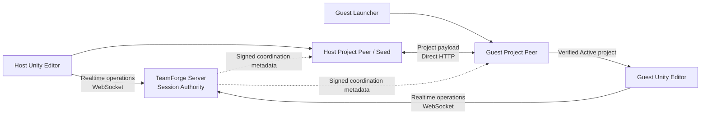

# TeamForge 工作原理

本页解释**当有人作为 Host 主持、作为 Guest 加入、传输项目、编辑 Scene、断开连接或从故障中恢复时，TeamForge 内部会发生什么**。

它有意是一份引导式说明，而不是完整的协议规范或源代码地图。

- 关于当前受支持 / 被阻断的功能集，请使用 [STATUS.zh-Hans.md](STATUS.zh-Hans.md)。
- 关于权威的实际拓扑（as-built）与信任边界，请使用 [architecture.md](architecture.md)。
- 关于文件级的实现导航，请使用 [CODEMAP.md](../CODEMAP.md)。
- 关于重要设计选择背后的原因，请使用 [architecture-decisions.md](architecture-decisions.md)。

## 60 秒模型

TeamForge 目前有两条刻意分离的数据路径：



重要的分离在于：

- **实时权威**经由 TeamForge Server。
- **项目文件载荷字节**在 Project Peer 之间直接移动。
- Server 协调项目元数据，但不会成为项目文件中继。
- Guest 在信任、完整性、激活与 Unity 交接检查通过之前，不会打开所接收的内容。

这种分离让大体积的项目传输远离对延迟敏感的协作流量，同时保留唯一且清晰的实时权威。

## 主要进程

### Unity 编辑器包

Unity 包是 TeamForge 中面向编辑器（Editor）的部分。它提供 Host 流程、实时连接生命周期、Presence（在线状态）、受支持的 Transform/Lock 与同一 Scene 的 Hierarchy 协作、诊断 / 恢复的呈现，以及将已批准的远端状态应用到本地 Scene。

Unity 客户端**遵循权威**。某个本地 Scene 值并不会仅仅因为它存在于某一个 Editor 中就变得具有权威性。

### TeamForge Server

Server 有两项截然不同的职责：

1. **Session Authority** — 成员管理、共享修订 / 顺序、锁 / 租约（lease）、保留的受支持 Scene 状态、重放 / 幂等保护，以及实时效果。
2. **Project Coordinator** — 已签名的项目 / 发布者 / 基线 / 对等方协调元数据。

Server 不存储也不中继常规的项目 Manifest/File/Chunk 载荷。

### Project Peer

Project Peer 拥有项目引导与传输行为：已签名邀请的验证、确定性的清单（manifest）与哈希、直接 HTTP 传输、经过验证的断点续传、暂存区、不可变的 Active 修订版本、文件系统 / 路径安全，以及项目 / 发布者信任检查。

一次成功的网络下载不足以激活项目。内容仍须通过完整的验证与信任路径。

### Windows Guest Launcher

全新 Guest 在 Unity 之外启动，因为此时可能还没有可打开的 Unity 项目。Launcher 会验证其捆绑的 TeamForge Runtime、检查邀请与信任状态、通过 Project Peer 接收项目、验证最终的 Active 项目与所需的 Unity 版本，然后移交给 Unity。

常规打包版 Guest 无需安装或手动操作系统级的 Node.js/npm。

为了排障，当前 Launcher 源还可以手动创建本地**支持包（support bundle）**。该 ZIP 是一个有边界 / 经过脱敏（redacted）的观测产物；它不会被自动上传，不会授予权威，也不会绕过邀请、信任、激活、Runtime、路径或 Unity 交接验证。某个打包候选版本是否包含该动作，取决于实际构建出的确切产物；[STATUS.zh-Hans.md](STATUS.zh-Hans.md) 与 [../builds/README.md](../builds/README.md) 区分了当前源与已发布的包。

## Host 启动协作时会发生什么

从高层来看：

```text
Host 选择 Publish & Start
        ↓
Unity Host 流程检查本地项目 / 已保存 Scene 的先决条件
        ↓
Project Peer 准备确定性的项目基线
        ↓
文件与块获得完整性身份
        ↓
Host Project Peer 启动直接传输 Seed
        ↓
项目 / 发布者 / 基线 / 对等方元数据与 Server 进行协调
        ↓
TeamForge 创建已签名的协作邀请
        ↓
Host 就绪，可以接待 Guest
```

确切实现中还包含额外的失败即拒绝（fail-closed）检查，但用户可见的关键要点是：**Host Ready 不仅仅意味着“开了一个端口”。** TeamForge 已经建立了 Guest 流程所需的项目传输与实时会话契约。

协作邀请并不打算承载访问码（access code）、私有签名密钥或任意的本地项目路径。访问码在使用时是单独共享的。

## 全新 Guest 加入时会发生什么

Guest 流程被刻意划分为多个阶段：

```text
打开 Windows Guest Launcher
         ↓
 验证捆绑的 TeamForge Runtime
         ↓
 载入 / 粘贴协作邀请
         ↓
 验证邀请的结构与签名
         ↓
 审查 Project / Owner / Publisher 的身份与信任
         ↓
 联系已协调好的 Host / Seed
         ↓
 接收描述符 / 清单 / 库存信息
         ↓
 仅下载所需的项目块
         ↓
 验证块、文件、清单与项目的完整性
         ↓
 在暂存区中构建
         ↓
 验证完整的候选项目
         ↓
 创建不可变的 Active 修订版本
         ↓
 移动小型的当前项目指针
         ↓
 验证所需的 Unity 可执行文件与最终交接
         ↓
 在 Unity 中打开已验证的项目
```

TeamForge 有意避免把任意一个部分下载的目录当作当前项目。在接收更新的修订版本期间，或在激活失败的情况下，先前已验证的 Active 修订版本仍可保持可用。

### 断点续传是感知验证的（verification-aware）

当传输中断时，在传输契约允许的情况下，TeamForge 可以复用已验证的内容。复用并不意味着“信任磁盘上碰巧存在的任何文件”；哈希与激活契约仍然具有权威性。

## 当有人编辑受支持的 Scene 对象时会发生什么

一个简化的 Transform 示例如下：

```text
用户移动一个受支持的 GameObject
         ↓
 Unity Transform 服务观察到本地变更
         ↓
 解析权威规范的对象身份
         ↓
 检查锁 / 租约与当前连接的权威
         ↓
 通过实时 WebSocket 发送 Transform 操作
         ↓
 Server 的 Session Authority 验证该操作
         ↓
 Server 应用排序 / 修订 / 幂等规则
         ↓
 已批准的效果被广播给其他客户端
         ↓
 远端客户端更新其所观察到的 Authority View
         ↓
 Unity 安全地应用已批准的远端 Transform
```

正因如此，以下几个概念贯穿 TeamForge 始终。

### 身份（Identity）

两个 Editor 需要指向**同一个逻辑对象**，而不仅仅是两个碰巧同名或同 Hierarchy 路径的对象。已保存的 Scene 对象使用稳定的 Unity 身份作为其基线身份，而受支持的会话内创建对象可以在权威绑定之后获得 TeamForge 逻辑身份。

含糊不清的身份会失败即拒绝，而不是悄悄地按名称、兄弟索引或路径去猜测。

### 权威（Authority）

Server 决定被接受的共享实时状态。客户端报告意图并应用被接受的结果；它们不会各自维护一套相互竞争的独立真相。

### 修订与顺序

被接受的操作会推进共享的权威顺序。修订（revision）信息使客户端能够推断过期状态、迟到加入、重放，以及某个操作是否是在预期的共享状态上被求值的。

### 锁 / 租约

受支持的编辑使用由权威控制的锁 / 租约，以避免两个用户在同一时间悄悄覆盖同一个对象。当客户端消失时，租约会过期，而不是变成永久性的锁。

### 重放 / 幂等保护

网络客户端可能会重试。因此，TeamForge 会区分同一操作的合法重试与试图复用某个身份的不同操作。重试不能仅仅因为消息被投递了两次，就把共享状态改变两次。

## Hierarchy 变更

受支持的同一 Scene 创建 / 删除 / 重命名 / 重挂父级 / 兄弟排序变更使用一条单独的权威 Hierarchy 路径，而不是假装它们是普通的 Transform 变更。

Hierarchy 权威之所以重要，是因为 Transform 是相对于对象结构的。如果两个对等方对父级归属或身份存在分歧，那么即使应用完全相同的本地 Transform 数值，也可能产生不同的 Scene。

通用的 Component/Inspector/Prefab/Asset 同步以及任意的跨 Scene 结构，不能从当前受支持的 Hierarchy 子集推断出来。当前边界请查阅 [STATUS.zh-Hans.md](STATUS.zh-Hans.md)。

## 重连与连接纪元（connection epoch）

重连不会被视为旧客户端权威仍然有效的证明。

从概念上讲：

```text
连接丢失
    ↓
停止信任连接范围内的权威
    ↓
重连 / 握手
    ↓
接收当前协商的能力与权威状态
    ↓
为新的连接纪元重新绑定受支持的对象权威
    ↓
仅在所需状态就绪后恢复常规协作
```

已持久化的别名或本地缓存的身份可能有助于解析，但它们本身不会在重连之后授予权威。

## 故障与恢复

TeamForge 力求保存已验证的状态，而不是“强行通过”未知状态。

示例：

- Runtime 损坏 → 在执行未经验证的打包代码之前停止；
- 邀请无效或冲突 → 保持既有项目绑定不变；
- 传输失败 → 在允许的情况下保存已验证的可复用进度；
- 激活失败 → 不替换先前已验证的 Active 项目；
- Unity 路径问题 → 仅使用经过单独验证的、TeamForge 自有的路径韧性策略；
- 基线 / 身份不匹配 → 要求进行对账 / 更新，而不是悄悄猜测；
- 所需端口上存在未知进程 → 不因为 TeamForge 想要该端口就杀掉它。

因此，恢复动作是**状态驱动的**。Retry、Paste New Invite、Use Latest Project、Open Existing Verified Project 或 Choose Unity 这类动作，只会在那种动作具有明确定义的安全含义的状态下才会被提供。

**诊断信息是观测性的，不是恢复权威。** 复制诊断（Copy diagnostics）与手动支持包帮助用户或 bug 报告描述当前这次运行。保存支持包不会更改所选的 Project、不会重试某个操作、不会信任某个 Publisher、不会激活内容，也不会放宽任何安全检查。支持包有意只收集有边界的安全状态视图，而不是宽泛的 Project / 机器数据，并且在公开分享之前仍应进行审查。

## 为什么项目传输与实时协作是分离的

把所有东西都放进一台服务器、一条 socket 里可能很诱人。TeamForge 目前有意不这样做。

实时协作受益于小而有序的权威消息。项目引导可能涉及大量文件与大字节流、重试、断点续传、哈希、暂存与磁盘工作。把这些界面分开，可以避免项目字节成为隐藏的服务器瓶颈，并使其安全 / 故障边界更易于推理。

代价是 Host Project Peer 必须对 Guest **直接可达**。因此，当前的直接传输适合同一台 PC、可达的 LAN 或受管 VPN（managed-VPN）环境。自动的 Internet 发现 / NAT 穿透 / 中继是一个独立的未来传输问题，并不是 P2P 这个词所隐含的内容。

## 状态存放在哪里

并非所有 TeamForge 状态都具有相同的生命周期。

| 状态 | 当前生命周期 / 所有者 |
| --- | --- |
| 实时 Session Authority | 活动会话期间的 Server 内存 |
| 项目协调注册表 | Server 内存 |
| 客户端 Authority View | 当前 Unity 连接 |
| 项目传输内容 / 暂存 | 受管的 Project Peer 存储 |
| 已验证的 Active 项目修订版本 | 持久的受管 Project 存储 |
| 当前 Active 指针 | 小型的持久元数据指针 |
| Launcher 诊断历史 | 有边界的当前运行历史 |
| 手动保存的支持包 | 用户创建的本地有边界 / 脱敏 ZIP；不自动上传 |

在考虑服务器重启、重连、项目续传或恢复时，这种区分非常重要。持久的已下载项目并不意味着持久的实时权威历史，已保存的诊断产物也不会成为协作权威的一部分。

## 沿着一项行为深入源码

如果本说明回答了**“发生了什么”**，而你想了解**“在哪里实现”**，请继续阅读 [CODEMAP.md](../CODEMAP.md)。

典型路径如下：

- 实时连接 → Unity `TeamForgeConnectionService` + Server WebSocket host；
- Transform/Lock → Unity Transform 服务 + Authority View + Server Session Authority；
- Hierarchy → Unity Hierarchy 服务 + Server Hierarchy 模型 / Session Authority；
- 项目引导 / 传输 → Project Peer Host/Guest 编排器 + 直接传输源 + 内容存储；
- Guest 启动 / 恢复 → Windows Launcher + Launcher Core + Guest 编排器；
- 支持诊断 → Launcher 诊断 UI + Launcher Core 支持包 / 脱敏路径；
- 路径韧性 → Launcher Core + 共享的 Project Peer 路径韧性契约。

确切的文件名与测试请使用代码地图，而不要把它们复制到本指南中。这样即使实现文件被重构，本说明仍然有用。
