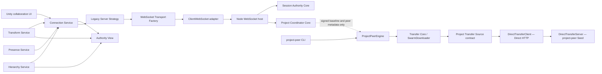

# TeamForge Architecture — Phase 4.5 Identity / Authority Audit Candidate

Date: 2026-08-11 (Asia/Seoul)  
Product: `0.5.0`  
Unity: `6000.3.21f1`  
Realtime Protocol: `1`  
Project Transfer Protocol: `1`  
Manifest schema: `1`

This document describes the implemented Phase 0–4 product plus the Phase 4.5 Architecture Foundation and its WP8 field identity correction. The automated candidate is complete, but Closure remains **BLOCKED** until the exact Unity/multi-Editor field gate passes. This is an as-built map, not a proposal for WebRTC, persistence, Component Sync, embedded authority, or Protocol v2.

## Current runtime topology

The only active realtime route is the configured TeamForge Server WebSocket. The only active Project payload route is direct HTTP between `project-peer` processes. The Server coordinates signed metadata and never relays or stores Project payload bytes.

## Layer and responsibility map

| Layer | Owns | Must not own |
| --- | --- | --- |
| Unity UI | Existing settings, connection controls, diagnostics, Invite/Project guidance | Socket construction, authority transitions, hash validation |
| Collaboration services | Presence sampling; Transform and Hierarchy observation/application; Scene dirty/Undo protection | Server-authoritative Revision/Lock rules |
| Authority View | Observed Session Revision, Lock registry, capabilities, connection identity | Persistent state or authoritative transition decisions |
| Connection Service | Lifecycle, connection intent, reconnect/backoff, Hello/handshake, main-thread dispatch, Protocol v1 routing | Concrete transport construction, route discovery, fallback |
| Connection Strategy | One ordered attempt for the configured legacy Server endpoint | Opening sockets or implementing a transport |
| Transport Factory/adapter | Configure and execute the existing reliable ordered WebSocket text channel | Protocol routing, reconnect policy, Scene behavior |
| Server host | HTTP health/upgrade, Bearer auth, WebSocket, JSON, rate/buffer/heartbeat timers, effect execution | Direct mutation of Authority/Coordinator registries; Project payload storage |
| Session Authority Core | Presence membership, Lock lease, shared Revision, Transform, Hierarchy, Tombstones, conflict/idempotency, ordered effects | HTTP, WebSocket, JSON parsing, host timers |
| Project Coordinator Core | Project UUID and Owner pin, signed baseline registry, publisher/owner verification orchestration, serial/idempotent publish, session-isolated peer registry, seed ranking and effects | Manifest/File/Chunk bytes, socket I/O, persistence |
| Transfer Core | Source selection, verified Resume, concurrency, pacing, retry/backoff/failover, final verification and progress | HTTP status/header interpretation |
| Transfer Source adapter | Descriptor/Manifest/Inventory/Chunk lookup plus transport-specific error normalization | Trust bypass, activation policy, alternate routes |
| Project Peer backend | Manifest/Chunk/hash, Direct HTTP serving, Staging/trust/immutable Active/atomic activation | Server authority or automatic relay |
| Policy/Profile | Immutable snapshots of existing configurable values under `LegacyPhase4Compatible` | Safety switches, new tuning, user-selectable profile framework |

## Dependency direction invariants

- `teamforge-server.mjs` composes `SessionAuthority` and `ProjectCoordinatorCore`; the two cores do not import HTTP/WebSocket, parse host JSON, schedule timers, or send/close sockets.
- Server source does not use filesystem write APIs. Session and Project Coordinator authority remain memory-only.
- Unity Transform and Hierarchy services consume the shared `IAuthorityView`. Hierarchy does not use `TeamForgeTransformSyncService.CurrentRevision`, `Locks`, or revision mutation as a public state store.
- `TeamForgeTransformSyncService.CurrentRevision` and `Locks` remain compatibility facade aliases.
- Collaboration identity is authority-canonical: a saved clean Scene object and saved parent use valid `GlobalObjectId` keys unless the current connection's Hierarchy authority has explicitly bound and the consumer accepts the exact `tf:` key. `Library/TeamForge` aliases are local resolver hints, while `EntityId`/Instance ID are live-process handles only. Presence, Transform, Lock and Hierarchy use this same rule; baseline `Contains`, parent matching and dirty-Scene fail-closed checks remain mandatory after canonicalization.
- `TeamForgeConnectionService` receives attempts from `LegacyServerStrategy` and transports from `WebSocketTransportFactory`; it does not construct `ClientWebSocketTransport` directly.
- `SwarmDownloader` consumes the structural Transfer Source contract and normalized errors. `DirectTransferClient` is the sole real source adapter and owns HTTP status/header semantics.
- No interface hierarchy or dependency-injection framework exists for Policy/Profile values.

## Object identity and authority contract

- Saved `GlobalObjectId` is the default wire/baseline identity for a saved loaded Scene object.
- An authoritative logical `tf:` ID is canonical only after the current `connectionId` epoch's Hierarchy authority binds it. It remains canonical for a runtime-created object after a later Scene save when the authoritative baseline contains the exact key.
- `Library/TeamForge/hierarchy-ids-v1.json` is a regenerable local alias cache. A cache hit may help resolve a local object but cannot grant session authority or change a saved object's outgoing ID.
- Reconnect or connection replacement clears current-session logical authority. Persisted aliases remain hints until the new Hierarchy snapshot/live apply confirms an exact binding.
- When Hierarchy is negotiated, outgoing and inbound Transform/Lock authority wait for `SnapshotReady`. A current-session logical key rejected by the Transform baseline fails closed instead of falling back to the same object's Global key; inbound Transform also requires current-epoch confirmation and exact canonical wire/object equality. Hierarchy changes and every Lock request/renewal revalidate the object and parent before authority use.
- Presence uses the selected object's Scene identity when it transmits a selected object. Transform and its parent share one canonicalizer; Lock messages use the exact tracked key; Hierarchy seed remains Global-only.
- Failed resolution remains fail-closed. There is no name, Hierarchy path or sibling-index fallback.

The complete consumer matrix and WP2-WP7 audit are frozen in [phase-4.5-wp8-identity-contract-matrix.md](phase-4.5-wp8-identity-contract-matrix.md).

## Phase 4.5 work-package ledger

| WP | Frozen boundary | Completion evidence |
| --- | --- | --- |
| WP0 | Correct Phase 4 UX Pass 4 Closure evidence, architecture and Protocol v1 documentation | Exact Phase 4 candidate/hash, Unity 94/94 user field evidence, A/B/C Late Join and UX evidence recorded |
| WP1 | Characterization/golden compatibility suite | Capability matrix, snapshot order, authority traces, Descriptor/Invite canonical fixtures |
| WP1 hotfix | JsonUtility fixture DTO compile accessibility | Unity 96/96 user verification; fixture/schema unchanged |
| WP2 | Session Authority Core extracted from host details | Presence/Revision/Lock/Transform/Hierarchy/Tombstone pure transitions and ordered effects |
| WP3 | Project Coordinator Core extracted from host details | UUID/Owner/publisher/publish/TOFU/peer isolation/ranking transitions and effects |
| WP4 | Unity Authority View and Collaboration dependencies | Shared observed state moved out of Transform; compatibility aliases retained |
| WP5 | Transport Factory and Legacy Connection Strategy | One configured Server attempt; existing ClientWebSocket adapter remains first implementation |
| WP6 | Transfer Source contract and stable Project Peer backend | `descriptor/manifest/inventory/chunk`; Direct HTTP remains sole real adapter |
| WP7 | Policy/Profile resolution | Only `LegacyPhase4Compatible`; current defaults/overrides frozen without safety bypasses |
| WP8 | Documentation, validator, Closure candidates and field checklists | Saved Transform field correction verified; comprehensive identity/authority audit candidate automated, Unity/multi-Editor field gate pending |

## Protocol v1 compatibility

The common JSON envelope, message types, error codes, capability meanings and versions remain unchanged. The negotiated initial message order is:

`hello_ack → presence_snapshot → hierarchy_snapshot → transform_snapshot → project_registry_snapshot`

Each snapshot is omitted when its capability is not negotiated. Hierarchy requires Presence and Transform. Project Transfer can be negotiated without Presence, so a standalone Project Peer receives `hello_ack → project_registry_snapshot`.

Hierarchy is before Transform so object/parent/tombstone identity exists before current Transform and Lock state is applied. Phase 0–4 behavior is frozen by the 16-case golden capability matrix and integration tests.

Realtime WebSocket carries reliable ordered UTF-8 JSON text messages and small Project coordination metadata only. Project Transfer v1 continues to use the existing Direct HTTP descriptor/manifest/inventory/chunk routes. No new message, header, route, schema version, or fallback meaning is introduced by Phase 4.5.

## Authority and state lifetime

- Server Session Authority owns authoritative in-memory Revision, Locks, retained Transforms, Hierarchy and bounded Tombstones.
- Project Coordinator owns in-memory Project/Baseline/Peer registries.
- Unity Authority View is transient to the live connection and is never a `ScriptableSingleton`.
- Project Peer Content Store, Staging and immutable Active revisions are the only implemented durable Project data path.
- Server restart recovery, persistent operation log, persistent authority snapshot and missing-revision fetch are not implemented. Those remain possible Phase 5 scope.

## Policy and safety floor

`LegacyPhase4Compatible` resolves the existing Unity settings, Server environment values and Project Peer CLI/constructor defaults into immutable/get-only snapshots. It does not change serialized settings fields, environment variables, CLI options, precedence, or numeric defaults.

The following are hard invariants, not Profile options: Project UUID validation; Owner/Publisher/Descriptor signatures; Manifest/Chunk/File/final hashes and sizes; path containment/traversal defense; symlink/junction/case-collision policy; verified Staging before atomic activation; non-destructive existing Active/User Project handling; and authoritative Revision/Lock/Hierarchy/Tombstone rules.

## Current limitations and deferred architecture

- Direct HTTP requires peer reachability. There is no WebRTC, RTCDataChannel, ICE, STUN, TURN, relay, LAN discovery, or automatic route fallback.
- The Server and Coordinator authority stores are memory-only. There is no Phase 5 persistent recovery.
- No serverless/embedded authority, host migration, Component Sync, code CRDT or general Asset Server behavior exists.
- Phase 4 supports the documented saved clean Scene GameObject hierarchy subset. Presence now keeps a selection coherent with its loaded Scene, but additive/cross-Scene structural operations, Prefab structural workflows and durable logical-ID migration remain fail-closed or unsupported.
- Public Internet deployment still requires operator-provided TLS termination, firewall/access policy, credential handling and Direct endpoint reachability.

Future work must enter through a separately approved phase or ADR. Phase 4.5 Closure does not authorize any deferred feature.
