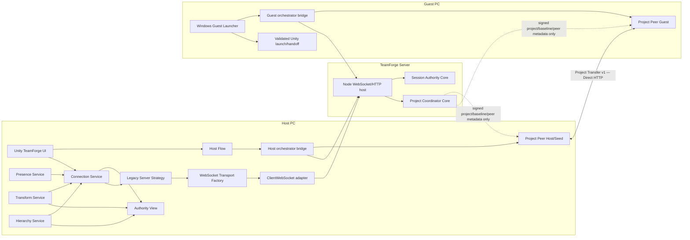

# TeamForge current architecture — 0.5.1 WP5.1

Last reviewed against the public source on 2026-08-20 (Asia/Seoul).

Product version: `0.5.1`  
Current release identity: `0.5.1-wp5.1-path-resilience`  
Current work package: `UX Bootstrap WP5.1 Path Resilience & Automatic Short Workspace`  
Release state: **FIELD BLOCKED**  
Unity package line: `6000.3`  
Candidate test Editor: `6000.3.21f1`  
Realtime Protocol: `1`  
Project Transfer Protocol: `1`  
Project Manifest Schema: `1`

This document is the **current as-built architecture overview** for the public `main` source. Release readiness is a separate question: use [STATUS.md](STATUS.md) and `release-contract.json` for the current validation state and exact candidate identity.

Historical Phase 4 / Phase 4.5 reports remain useful evidence for the architecture foundation, but they do not override this document when later 0.5.1 WP4/WP5/WP5.1 work changed packaging, Host/Guest orchestration, diagnostics, or path handling.

## Current runtime topology

The configured TeamForge Server WebSocket is the sole implemented realtime authority route. Project payload bytes use direct HTTP between Project Peer processes and do **not** pass through the TeamForge Server or Project Coordinator.

The normal packaged Windows Host/Guest path uses a bundled, hash-verified Node runtime. System Node/npm are developer/source-workspace requirements, not normal end-user prerequisites.

## Major process responsibilities

| Layer / process | Owns | Must not own |
| --- | --- | --- |
| Unity UI / Host Flow | User-facing Host controls, baseline review, endpoint input, diagnostics, safe workflow state | Server authority transitions, raw socket implementation, bypass of project verification |
| Collaboration services | Presence sampling; Transform and Hierarchy observation/application; Scene dirty/Undo protection | Server-authoritative Revision/Lock rules |
| Authority View | Observed Session Revision, Lock registry, capabilities, connection identity | Persistent state or authoritative transition decisions |
| Connection Service | Lifecycle, connection intent, reconnect/backoff, Hello/handshake, main-thread dispatch, Protocol v1 routing | Concrete transport construction, route discovery, transport fallback |
| Connection Strategy | One ordered attempt for the configured TeamForge Server endpoint | Opening sockets or implementing a transport |
| Transport Factory/adapter | Configure and execute the reliable ordered WebSocket text channel | Protocol routing, reconnect policy, Scene behavior |
| Server host | HTTP health/upgrade, Bearer auth, WebSocket, JSON, rate/buffer/heartbeat timers, effect execution | Project payload storage/relay; direct mutation that bypasses authority cores |
| Session Authority Core | Presence membership, Lock lease, shared Revision, Transform, Hierarchy, Tombstones, conflict/idempotency, ordered effects | HTTP, WebSocket, JSON parsing, host timers |
| Project Coordinator Core | Project UUID and Owner pin, signed baseline registry, Publisher/Owner verification orchestration, publish ordering/idempotency, session-isolated peer registry, seed ranking/effects | Manifest/File/Chunk bytes, filesystem payload storage, persistence |
| Host orchestrator / Project Peer Host | Preflight, explicit publish/start lifecycle, baseline/Invite coordination, Direct HTTP seed process | Realtime authority or silent baseline replacement |
| Transfer Core | Source selection, verified resume, concurrency, pacing, retry/backoff/failover, final verification and progress | HTTP status/header interpretation or trust bypass |
| Transfer Source adapter | Descriptor/Manifest/Inventory/Chunk lookup plus transport-specific error normalization | Activation policy, trust bypass, automatic alternate transport |
| Project Peer storage/backend | Manifest/chunk/hash processing, staging, immutable Active revisions, atomic `current.json` movement | Realtime authority, automatic relay, destructive overwrite of arbitrary user projects |
| Windows Guest Launcher | Invite/access-code input, explicit trust UI, verified bundled-runtime execution, managed destination, final Unity handoff | Project authority, signature/hash bypass, shell-based arbitrary launch |
| Diagnostics / recovery UX | Stable user-facing explanations, redacted bounded current-run diagnostics, state-driven safe actions | Persistent secret history, bypass of trust/activation/Scene-baseline checks |
| Path resilience layer | Safe managed workspace/path selection and short execution paths for the packaged Windows candidate | Weakening containment, hash, trust, or final handoff validation |

## Dependency direction invariants

- `server/src/teamforge-server.mjs` composes the Session Authority and Project Coordinator logic; authority state remains separated from HTTP/WebSocket host details.
- Server/Coordinator project state is metadata-only and memory-only. The Server does not become a Project payload store.
- Unity Transform and Hierarchy services consume shared observed authority state rather than treating Transform state as the general authority store.
- `TeamForgeConnectionService` receives connection attempts from the configured strategy and transports from the transport factory; it does not own a second hidden realtime route.
- Project transfer stays behind the Project Transfer source boundary. Direct HTTP is the only real payload adapter in 0.5.1.
- The packaged Host and Guest bridges execute from a manifest-pinned bundled runtime. Developer CLIs remain available for source development and advanced diagnostics but are not the normal fresh-Guest product path.
- Diagnostics and recovery actions must preserve existing trust, activation, identity, and Scene-baseline fail-closed behavior.
- WP5.1 path resilience changes execution/workspace path handling, not Realtime Protocol v1, Project Transfer Protocol v1, Project Manifest Schema v1, or the authority model.

## Object identity and authority contract

- Saved `GlobalObjectId` is the default wire/baseline identity for a saved loaded Scene object.
- An authoritative logical `tf:` ID becomes canonical only after the current connection epoch's Hierarchy authority binds it. It can remain canonical for a runtime-created object after a later Scene save when the authoritative baseline contains that exact logical key.
- `Library/TeamForge/hierarchy-ids-v1.json` is a regenerable local alias cache. A cache hit may help resolve a local object but cannot itself grant session authority or change a saved object's outgoing identity.
- Reconnect or connection replacement clears current-session logical authority. Persisted aliases remain hints until the new Hierarchy snapshot/live apply confirms an exact binding.
- When Hierarchy is negotiated, Transform/Lock authority waits for the required authoritative snapshot state. Identity/baseline mismatches fail closed rather than silently falling back to another object key.
- Presence, Transform, Lock, and Hierarchy use the same authority-canonical identity rules. Name, Hierarchy path, and sibling index are not authority fallbacks.

The detailed historical identity/authority audit matrix remains in [phase-4.5-wp8-identity-contract-matrix.md](phase-4.5-wp8-identity-contract-matrix.md). Treat that matrix as frozen Phase 4.5 evidence where it discusses candidate-specific validation counts or closure state.

## Project bootstrap, transfer, and activation contract

- A fresh Guest uses the standalone Windows Launcher in a packaged candidate; the source checkout contains launcher source/tests but intentionally does not commit the generated `launcher/win-x64/` release folder.
- Host Ready requires a signed `teamforge-bootstrap-invite-v1` Collaboration Invite containing separately validated Project Transfer and TF1 realtime contracts.
- The access code is shared separately and is not embedded in the Collaboration Invite.
- Project payload transport is direct HTTP between Project Peers. The Coordinator carries signed metadata and realtime/project coordination state only.
- Owner/Publisher fingerprints, signed descriptors/invites, manifest/file/chunk hashes, path policy, staging, immutable Active revisions, and final handoff checks fail closed.
- Successful activation creates or selects a verified immutable Active revision and moves the small current pointer only after verification. Existing arbitrary user projects are not silently overwritten.
- Publisher/Project trust is explicit. Changed Project UUID/Owner or tampered invites fail before stored trust bindings are replaced; Publisher changes require explicit review/trust.

## Runtime and packaging boundary

The current release contract selects:

- bundled Node `24.19.0`;
- supported source/developer Node `>=22.23.2 <23 || >=24.18.1 <25`;
- npm release tooling `11.19.0`;
- `ws@8.21.3`;
- Windows Launcher target `net10.0-windows` with self-contained .NET runtime `10.0.11`;
- reproducible/tested .NET SDK `10.0.303`;
- Windows x64 packaged target.

Generated runtime payloads, packaged executables, runtime manifests, and release ZIPs are release artifacts rather than canonical source-tree files. Source paths that describe `launcher/win-x64/` or packaged `Runtime~/` layouts describe generated candidates, not files guaranteed to exist in a fresh source clone.

## Protocol v1 compatibility

The common JSON envelope, message types, error codes, capability meanings, and protocol versions remain version 1. The negotiated initial realtime message order remains:

`hello_ack → presence_snapshot → hierarchy_snapshot → transform_snapshot → project_registry_snapshot`

Each snapshot is omitted when its capability is not negotiated. Hierarchy depends on the collaboration capabilities it needs; Project Transfer coordination can be negotiated without Presence for standalone Project Peer coordination.

Realtime WebSocket carries reliable ordered UTF-8 JSON text messages and small Project coordination metadata. Project Transfer v1 uses Direct HTTP descriptor/manifest/inventory/chunk routes. WP4/WP5/WP5.1 did not introduce a second payload route or a silent relay fallback.

## Authority and state lifetime

- Server Session Authority owns authoritative in-memory Revision, Locks, retained Transforms, Hierarchy, and bounded Tombstones.
- Project Coordinator owns in-memory Project/Baseline/Peer registries.
- Unity Authority View is transient to the live connection.
- Project Peer Content Store, staging, and immutable Active revisions are the implemented durable Project data path.
- Diagnostic history is bounded and current-run only.
- Persistent server/session operation history, durable authority snapshots, server restart recovery, and missing-revision fetch remain unimplemented.

## Network and security boundary

- Direct HTTP requires peer reachability on the same PC, reachable LAN, or managed VPN.
- A two-PC Collaboration Invite advertises a concrete Guest-reachable host; wildcard/unspecified/loopback addresses are not valid advertised two-PC Guest endpoints.
- Non-loopback listeners require an access code. The shared-token design is for a trusted LAN/VPN/team environment, not an untrusted public-internet identity system.
- There is no WebRTC, RTCDataChannel, ICE, STUN, TURN, relay, automatic NAT traversal, LAN discovery, or automatic transport fallback.
- Public Internet deployment is not a current supported topology and would require additional transport, identity, TLS/access, and operational work.

## Current limitations and release boundary

- The current Windows x64 candidate is **FIELD BLOCKED**. Automated qualification is not the same as completed two-PC/Unity field validation.
- General Component/`SerializedProperty`, Inspector, Prefab structure, general Asset synchronization, code CRDT, and general Asset Server behavior are not supported capabilities.
- Cross-Scene structural collaboration remains outside the supported same-Scene Hierarchy subset.
- Persistent restart recovery is not implemented.
- macOS/Linux standalone launchers are not packaged as equivalent current candidates.
- Launcher Authenticode signing is not part of the current candidate.
- The repository has not completed a professional independent security audit.

For the exact current readiness statement, use [STATUS.md](STATUS.md). For exact current runtime/tool/candidate identity, use [`../release-contract.json`](../release-contract.json). For version history, use [`../CHANGELOG.md`](../CHANGELOG.md). Historical Phase 4.5 reports remain evidence for their recorded candidates, not a competing current source of truth.
