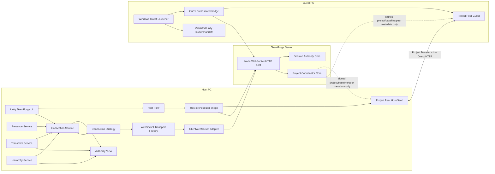

# TeamForge current architecture

This document describes the **current as-built architecture and trust boundaries** of TeamForge source.

It intentionally avoids owning volatile release-readiness, candidate-tag, tool-version, or test-run state:

- current capability/readiness → [STATUS.md](STATUS.md)
- exact runtime/tool/protocol/release selections → [`../release-contract.json`](../release-contract.json)
- packaged artifact identity → [`../builds/README.md`](../builds/README.md)
- planned direction → [ROADMAP.md](ROADMAP.md)

Historical phase/ADR records remain useful context, but they do not override this document when later source changed the as-built structure.

## Runtime topology

The configured TeamForge Server WebSocket is the implemented realtime authority route. Project payload bytes move directly between Project Peer processes over HTTP and do **not** pass through the TeamForge Server or Project Coordinator.

The normal packaged Windows Host/Guest path uses a manifest-pinned bundled Runtime. System Node/npm are source-development requirements rather than normal end-user prerequisites.

## Major process responsibilities

| Layer / process | Owns | Must not own |
| --- | --- | --- |
| Unity UI / Host Flow | User-facing Host controls, baseline review, endpoint input, diagnostics, safe workflow state | Server authority transitions, raw socket implementation, bypass of Project verification |
| Collaboration services | Presence sampling; Transform/Hierarchy observation and application; Scene/Undo safety behavior | Server-authoritative Revision/Lock decisions |
| Authority View | Observed Session Revision, Lock registry, capabilities, connection identity | Persistent state or authoritative transitions |
| Connection Service | Lifecycle, reconnect/backoff, handshake, main-thread dispatch, protocol routing | Hidden second realtime route or server authority |
| Connection Strategy | Ordered connection attempt for the configured TeamForge Server endpoint | Raw transport implementation or authority state |
| Transport Factory / adapter | Reliable ordered WebSocket text-channel construction/execution | Protocol routing, reconnect policy, Scene behavior |
| Server host | HTTP health/upgrade, Bearer auth, WebSocket/JSON I/O, rate/buffer/heartbeat timers, effect execution | Project payload storage/relay or authority rules duplicated outside the cores |
| Session Authority Core | Presence membership, lock leases, shared Revision, Transform, Hierarchy, Tombstones, conflict/idempotency and ordered effects | HTTP, WebSocket, JSON parsing or host timers |
| Project Coordinator Core | Project/Owner/publisher/baseline/peer coordination metadata and ordered effects | Manifest/File/Chunk bytes, filesystem payload storage or realtime Scene authority |
| Host orchestrator / Project Peer Host | Preflight, explicit publish/start lifecycle, baseline/Invite coordination, direct Seed process | Realtime authority or silent baseline replacement |
| Transfer Core | Source selection, verified resume, concurrency, pacing, retry/backoff/failover, final verification and progress | Trust bypass or activation policy hidden in transport details |
| Transfer Source adapter | Descriptor/Manifest/Inventory/Chunk lookup and transport-specific error normalization | Activation policy, trust replacement or silent alternate transport |
| Project Peer storage/backend | Manifest/chunk/hash processing, staging, immutable Active revisions, atomic current-pointer movement | Realtime authority or destructive overwrite of arbitrary user projects |
| Windows Guest Launcher | Invite/access-code input, trust UI, verified bundled-Runtime execution, managed destination, final Unity handoff | Project authority, signature/hash bypass or arbitrary shell launch |
| Diagnostics / recovery UX | Stable user-facing explanations, redacted bounded diagnostics, state-driven recovery actions | Persistent secret history or bypass of trust/activation/baseline checks |
| Path resilience layer | Managed path selection and approved short execution-path preparation | Weakening containment, identity, hash, trust or final handoff validation |

## Dependency-direction invariants

- The Server host composes authority/coordinator cores; it should not duplicate their state-transition rules.
- Server/Coordinator Project state is metadata-only and memory-resident. The Server does not become a Project payload store.
- Unity Transform and Hierarchy services consume observed authority state rather than becoming independent authority stores.
- `TeamForgeConnectionService` owns lifecycle/routing around the configured connection path; it does not own a hidden fallback authority route.
- Project transfer stays behind the Project Transfer source boundary. The current payload route is direct Project Peer HTTP.
- Packaged Host/Guest bridges execute from a manifest-pinned Runtime. Developer CLIs remain development/diagnostic paths, not the normal fresh-Guest UX.
- Diagnostics/recovery must preserve trust, activation, identity and Scene-baseline fail-closed behavior.
- Path-resilience work may change execution/workspace path handling but must not silently change authority, identity, protocol or trust rules.

## Object identity and authority contract

- Saved loaded Scene objects use stable Unity identity (`GlobalObjectId`) as the default saved-object wire/baseline identity.
- An authoritative logical `tf:` identity becomes canonical only after the current connection epoch's Hierarchy authority binds it.
- Local alias/cache data may help resolve an object but cannot itself grant session authority or replace a saved object's authoritative outgoing identity.
- Reconnect or connection replacement clears current-session logical authority; persisted aliases remain hints until the new authoritative snapshot/live state confirms the binding.
- When Hierarchy is negotiated, dependent Transform/Lock authority waits for the required authoritative identity/snapshot state.
- Identity/baseline mismatches fail closed rather than silently falling back to a name, Hierarchy path, sibling index or guessed object.
- Presence, Transform, Lock and Hierarchy should use the same authority-canonical identity model rather than maintaining incompatible fallback schemes.

Historical identity/authority matrices under the phase records remain evidence for their recorded implementation state, not a competing current contract.

## Realtime authority contract

The Session Authority Core owns the authoritative in-memory collaboration state for the live session:

- Presence membership;
- shared Revision/order;
- lock/lease state;
- retained Transform state;
- supported same-Scene Hierarchy state;
- bounded Tombstones and replay/idempotency protection.

Unity clients observe and apply authority; they do not become authoritative merely because local Editor state differs.

Unsupported or ambiguous edits should remain protected/fail-closed until the relevant synchronization surface has an explicit identity, authority, conflict and recovery contract.

## Project bootstrap, transfer and activation contract

- A fresh packaged Guest begins in the standalone Windows Launcher before a Unity project is open.
- Host Ready produces a signed Collaboration Invite containing separately validated Project-transfer and realtime-session contracts.
- The access code is shared separately and is not embedded into the invite.
- Project payload bytes move directly between Project Peers; the Coordinator carries signed metadata and coordination state only.
- Owner/Publisher identity, signed descriptors/invites, manifest/file/chunk hashes, path policy, staging, immutable Active revisions and final handoff checks fail closed.
- Successful activation creates/selects a verified immutable Active revision and moves only the small current pointer after verification.
- Existing arbitrary user projects are not silently overwritten as a normal activation strategy.
- Publisher/Project trust changes require explicit validation/review rather than silent replacement.

## Runtime and packaging boundary

Generated Runtime payloads, packaged executables, Runtime manifests and release ZIPs are **release artifacts**, not canonical source-tree files.

The exact selected versions and target frameworks belong to [`../release-contract.json`](../release-contract.json). Source documentation should avoid copying those numbers unless the number itself is essential to the explanation.

Source paths that describe packaged layouts such as generated Launcher output describe release candidates, not directories guaranteed to exist in a fresh clone.

## Protocol compatibility boundary

The exact current protocol/schema version selections are recorded in [`../release-contract.json`](../release-contract.json).

Architecturally:

- realtime collaboration uses a reliable ordered WebSocket text channel;
- Project payload transfer uses separate direct HTTP descriptor/manifest/inventory/chunk routes;
- realtime and Project payload transport remain separate responsibilities;
- capability negotiation controls which snapshots/features a client receives;
- adding a new synchronization surface must not silently reinterpret an existing protocol contract in an incompatible way.

## State ownership and lifetime at a glance

| State | Authority / owner | Stored where | Lifetime | Recovery / rebuild boundary |
| --- | --- | --- | --- | --- |
| Presence membership | Server Session Authority | server memory | live session | rebuilt from current membership/snapshot after join/rejoin |
| Transform / Lock / supported Hierarchy state | Server Session Authority | server memory | live session | clients rebind/reconcile from current authoritative state; durable server-restart recovery is not implemented |
| Project coordination metadata | Project Coordinator | server memory | current coordinator process/session | re-coordinate through a valid current session rather than treating stale local metadata as authority |
| Project chunks / staging content | Project Peer | local disk | durable local project-transfer state | verified content may be reused for resume when the transfer contract allows it |
| Immutable Active project revision + current pointer | Project Peer storage/backend | local disk | durable | failed/new transfer does not need to destroy the previous verified Active revision; pointer moves only after verification |
| Unity Authority View | Unity client | client memory | connection epoch | connection replacement clears connection-scoped authority and rebuilds it from the new authoritative state |

This table is a navigation summary, not a second state specification. The detailed contracts below and current source/tests remain authoritative for implementation behavior.

## State lifetime

- Server Session Authority state is currently memory-resident.
- Project Coordinator registries are currently memory-resident.
- Unity Authority View is transient to the live connection.
- Project Peer content/staging/immutable Active revisions provide the implemented durable Project-data path.
- Diagnostic history is bounded and current-run oriented.
- Persistent server/session operation history, durable authority snapshots and old-session restart recovery are separate future capabilities rather than implicit current behavior.

## Network and security boundary

- Direct Project Peer HTTP requires actual peer reachability, such as same PC, reachable LAN or managed VPN.
- A two-PC invite must advertise a concrete Guest-reachable Host origin; wildcard/unspecified/loopback addresses are not valid remote Guest destinations.
- Non-loopback listeners require authentication according to the current server/Host policy.
- The shared access-code model is designed for a trusted team/LAN/VPN environment, not as a public-Internet identity system.
- Internet relay/NAT-traversal/discovery capabilities must be treated as separate transport/security work rather than assumed from the word `P2P`.
- Runtime/file/path/identity checks are trust boundaries. Convenience features must not generalize a narrow verified exception into acceptance of arbitrary redirected or untrusted content.

## Supported collaboration boundary

The current supported collaboration model is narrower than arbitrary Unity project synchronization.

General Component/Inspector/Prefab/Asset synchronization, cross-Scene structural collaboration, persistent restart recovery, platform-equivalent launchers and broader Internet transport are tracked through [STATUS.md](STATUS.md) and [ROADMAP.md](ROADMAP.md), not asserted here as current capabilities.

## Architecture decisions

Use [architecture-decisions.md](architecture-decisions.md) for important decisions and their historical context.

A historical decision can remain valuable even after being replaced. Explicitly superseded decisions must not override current source or this as-built architecture.
