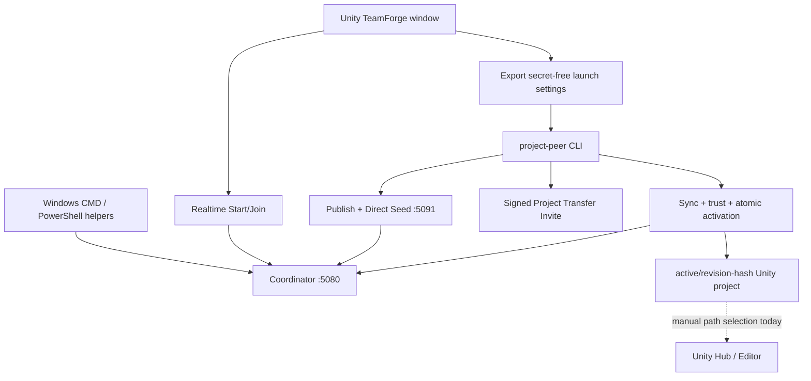
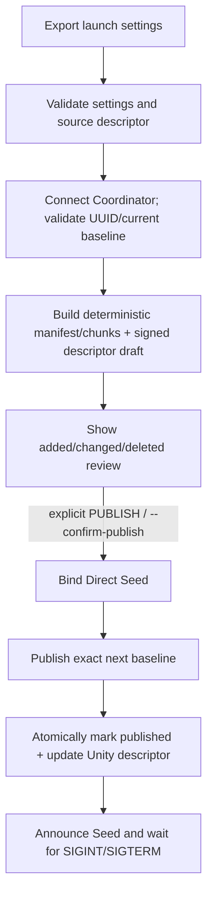

# TeamForge UX Bootstrap WP0 — Current Flow Audit & Orchestrator Contract

Date: 2026-08-13 KST  
Baseline: `Unity-TeamForge-Phase4.5-WP8-identity-authority-rearm-rootcause-hotfix-candidate.zip`  
Baseline SHA-256: `EA2808125C2FD264EFE730D191FA8C67C54938CCADE40ADB3F8039B20EDD68AC`  
Product line: TeamForge `0.5.0`, Realtime Protocol v1, Project Transfer Protocol v1

## 1. WP0 result

WP0 freezes the current execution map and a non-wired orchestration contract. It does not connect a new launcher to the existing product and does not change Server, Publish, Seed, Invite, Sync, activation, realtime Authority, or Unity UI behavior.

The audit confirms the main UX gap: the existing Unity `Start Collaboration` path prepares a saved Scene, project/session identity, a secret-free realtime join code, and the realtime connection. It does **not** start the Coordinator, install Project Peer dependencies, Publish a Project baseline, run a Seed, create the signed Project Transfer invite, Sync a missing Project, or open the returned Active Project. Those functions exist, but they are split across the Unity Editor, Windows helper scripts, and a long-running Node CLI.

The one-click layer must therefore orchestrate existing verified cores rather than reimplement them.

## 2. Evidence boundary

### Prior handoff evidence, not rerun by WP0

- Unity 6000.3.21f1 EditMode: `123/123 PASS — USER VERIFIED`
- Final A/B/C field gate and Project minimum smoke: recorded as closed in the latest 2026-08-13 handoff section

### New WP0 execution evidence

- Original candidate SHA-256 matched the handoff exactly.
- ZIP safety inspection found 325 bounded entries and no absolute/traversing entry before extraction.
- Server tests: `72/72 PASS`.
- Project Peer tests before WP0 changes: `73/73 PASS`.
- Project Peer tests after the inactive contract seam: `75/75 PASS`.
- Server smoke: PASS.
- Project Peer Direct Transfer smoke: PASS; `serverRelayUsed=false`.
- Server syntax check: PASS.
- Project Peer syntax check: PASS (`40` modules).
- Final repository validator: PASS (`329` files, `53` C# sources, Protocol v1).
- Candidate fresh extraction parity: PASS (`329/329`, `0` missing/extra/hash differences).
- Fresh extraction Server tests: `72/72 PASS`.
- Fresh extraction Project Peer tests: `75/75 PASS`.
- Fresh extraction Server and Direct Transfer smoke: PASS; `serverRelayUsed=false`.
- Unity EditMode: **NOT RUN** in WP0.
- A/B/C field session: **NOT RUN** in WP0.
- Windows/macOS/Linux launcher field execution: **NOT RUN**; WP0 defines the contract only.

## 3. Current topology

There are two distinct invite surfaces and they must remain distinct in the contract:

1. The Unity `TF1` realtime/session join code configures Project/Session/Scene/Server fields and contains no Project payload.
2. The signed `teamforge-project-invite-v1` JSON is the Project Transfer trust anchor verified by `project-peer` before Sync.

The Guest bootstrap path needs the signed Project Transfer invite first. After Active is opened, the realtime invite can be restored/applied for collaboration.

## 4. Current execution audit

### 4.1 Coordinator start and stop

Entry points:

- `Start-TeamForge-Local.cmd` invokes `scripts/teamforge.ps1 server` by script-relative absolute location.
- `Start-TeamForge-LAN.cmd` adds `-Lan -GenerateToken`.
- `npm start` invokes `server/src/index.mjs` directly.

Current lifecycle:

1. `teamforge.ps1` requires Node 20+ and npm.
2. Server `ws` is installed with locked `npm ci` only when `server/node_modules/ws/package.json` is absent.
3. Local mode sets `TEAMFORGE_HOST=127.0.0.1`; LAN mode sets `0.0.0.0` and requires/generates a bearer token.
4. `server.start()` binds the configured host/port, default `5080`, then exposes `/health` and `/ws`.
5. `server/src/index.mjs` handles `SIGINT` and `SIGTERM`, calls `server.stop()`, terminates clients, clears in-memory authority/coordinator state, and closes WebSocket/HTTP servers.

Observed gaps:

- There is no pre-bind ownership check or reuse of an already healthy TeamForge Server.
- `EADDRINUSE` is surfaced as a raw startup error.
- There is no launcher-owned process record or cross-platform process-tree cleanup.
- Server state is in memory; restarting it is not Phase 5 recovery.

The `/health` response is sufficient to identify a compatible TeamForge process (`service`, `serverVersion`, `protocolVersion`) before reuse. A successful TCP connection alone is not sufficient proof of ownership or compatibility.

### 4.2 Dependency bootstrap

Current locations:

- Root `npm run install:all` installs both Server and Project Peer.
- `scripts/teamforge.ps1 install` installs both.
- `server`/`dev` install the Server dependency only.
- `test`/`smoke`/`verify` install both when `ws` is absent.
- Direct `project-peer/src/cli.mjs publish|seed|sync` has no bootstrap wrapper; module loading fails before the CLI can normalize `ERR_MODULE_NOT_FOUND`.

Contract consequence:

- `inspect` must check Node version, npm availability, both lockfiles, and both `ws` installations before starting a workflow.
- Dependency repair must be a separately visible local mutation. It must not run concurrently with Server/Seed because `npm ci` performs a clean install and can remove an existing `node_modules` tree.
- Development dependency bootstrap and a future bundled runtime are separate implementation strategies. WP0 chooses neither.

### 4.3 Launch settings and managed root

Unity requires explicit `Use Current Project as Seed Source` consent. This creates/reads only `ProjectSettings/TeamForgeProject.json` and records intent; it does not scan, sign, publish, upload, or start a process.

Exported launch settings:

- are bounded, exact-schema, secret-free JSON;
- contain environment-variable **names**, never tokens/private keys;
- resolve all paths from the launch-settings file directory;
- normally use `sourceProjectRelativePath="."` and `managedProjectsRelativePath="TeamForgeProjects"`;
- must be saved in the current Unity Project root when the Project is a seed source;
- reject absolute/traversing paths, unknown fields, links, protocol mismatch, and unsafe overrides.

CLI managed-root precedence is:

1. resolved launch settings;
2. `--managed-root`;
3. `TEAMFORGE_MANAGED_ROOT`;
4. `path.resolve("TeamForgeProjects")` from the current working directory.

The fourth path explains the observed wrong-CWD and `project_not_initialized` friction. The orchestrator contract therefore requires absolute executable/script paths, an explicit absolute working directory, and an absolute resolved managed root. It must never depend on the caller's current directory.

### 4.4 Publish

Current code path:

Safety boundaries that must remain:

- no-op Publish is rejected unless `--force-new-revision` is explicit;
- source UUID/Owner/baseline must agree with the Coordinator;
- draft metadata/chunks are not Seed-selectable until approved;
- Publish review and explicit confirmation are separate from preparation;
- the source descriptor is rechecked before remote Publish;
- Server acknowledgement precedes the approved pointer and Unity descriptor update;
- Publish failure does not silently become Seed or create a fake success state.

Current UX gap: Publish also starts the long-running Seed, but invite creation is a separate command and the operator must keep the terminal alive.

### 4.5 Seed

`seed` selects an immutable Active or Coordinator-approved Baseline, never a lone draft. It binds the Direct HTTP server (default `127.0.0.1:5091`), announces endpoint/token/inventory to the Coordinator, reconnects with bounded backoff after a Coordinator close, and remains alive until a signal. `running.stop()` closes the Coordinator and Direct Transfer server.

Current gaps:

- `EADDRINUSE` does not distinguish a compatible existing TeamForge Seed from another process.
- There is no owned-process registry, duplicate prevention, or lifecycle state exposed to Unity.
- A process on the desired port must never be killed merely because the port is needed.

### 4.6 Signed Project Transfer invite

`invite create` requires a locally initialized Project, loads the Owner identity, creates a signed invite bound to Server/Realtime path/Project UUID/Session/Owner, and saves it without embedding credentials. `invite import` verifies and stores the invite, rejecting a conflicting trust anchor.

The one-click Host contract creates/copies/saves this invite only after a successful approved Publish and ready Seed. The realtime `TF1` code may be produced as a separate follow-on artifact for the Editor session.

### 4.7 Sync, trust, and activation

Current flow:

1. Load and verify the signed Project Transfer invite.
2. Connect to the invite's Coordinator and obtain the approved Baseline/direct peers.
3. On Windows, assess the predicted Unity Active path and warn on high risk.
4. Discover signed descriptor/manifest from a valid Seed.
5. Download verified chunks with retry/failover/resume; optionally advertise verified partial chunks.
6. Materialize to a new staging directory and verify every file, required Unity metadata, Unity version, descriptor, and manifest.
7. Show the full Publisher fingerprint and require explicit trust.
8. Rename the staged Project to immutable `active/<revision>-<manifest-prefix>` and atomically write `metadata/current.json`.
9. Return JSON containing `state`, `activePath`, `stagingPath`, and transfer/resume counters.
10. Stop the temporary partial Seed and close the Coordinator.

If trust is not approved, state remains `AwaitingTrust`, staging is retained, and the CLI exits with code `3`. Verification/transfer failure retains diagnostic staging and preserves the prior Active pointer.

### 4.8 Active Project resolution and open

The authoritative local resolution is `ManagedProjectStore.current()`:

- read `<managed-root>/<project-uuid>/metadata/current.json`;
- validate UUID/revision/hash/path fields;
- resolve the relative path under the same Project root;
- require an existing child of `active/`;
- return its absolute `activePath`.

Today, `sync`/`status` print this path. There is no standalone `Open Project` helper. Inside an already open Editor, the UX can ask the user for a matching Project and call `EditorApplication.OpenProject(folder)` after a save prompt, but a first-time Guest has no Editor Project from which to run that UI.

The launcher contract must validate the current pointer and Unity Project markers before open. Preferred open paths are:

1. From an existing compatible Editor: save prompt, then `EditorApplication.OpenProject(activePath)`.
2. From a standalone launcher: resolve a compatible Unity executable and start it with `-projectPath <absolute-active-path>`.
3. If no compatible Editor is found: show/reveal the validated path and request an explicit Editor selection; do not guess or open the `active` parent folder.

Unity documents both `EditorApplication.OpenProject` and the cross-platform Editor executable forms for `-projectPath`. `EditorApplication.applicationPath` can identify the currently running Editor binary, but it does not solve first-time Guest discovery.

## 5. Port and process ownership contract

### Coordinator `5080`

- Probe the configured `/health` with a short timeout.
- Reuse only when `service=unity-teamforge-server`, version/protocol are compatible, endpoint settings match, and required authentication is available.
- If the port accepts a connection but the health identity is absent/incompatible, report `port_conflict`; do not terminate or reuse it.
- If absent, start one launcher-owned Coordinator and record its process handle/start token/configuration.

### Direct Seed `5091`

- Reuse only a Seed already owned by the same orchestrator instance and bound to the exact Project UUID, Session, revision, manifest, endpoint, and transfer token state.
- Otherwise report `port_conflict` with inspect/change-port actions.
- Never infer ownership from a PID alone and never kill an unknown process by port number.

### Shutdown

- Stop only processes launched/adopted with verified TeamForge identity and matching ownership metadata.
- Close Seed/Coordinator clients and HTTP servers cooperatively, await completion, then escalate only for the same owned process tree.
- POSIX can use `SIGTERM` with an awaited exit; Windows Node signal delivery is not equivalent and can be abrupt, so WP2 must add/test a cooperative control path or owned wrapper before forceful cleanup.
- Editor reload/exit must request shutdown but must not block indefinitely or kill unrelated processes.

## 6. Cross-platform matrix

| Area | Windows | macOS | Linux | Frozen contract |
|---|---|---|---|---|
| Current bootstrap helper | `.cmd` + PowerShell | none | none (test shell only) | WP1/WP2 must not claim parity until implemented/tested |
| Unity executable example | `.../Editor/Unity.exe` | `Unity.app/Contents/MacOS/Unity` | `.../Editor/Unity` | use absolute executable + `-projectPath` |
| Running Editor path | `EditorApplication.applicationPath` | same API | same API | prefer exact running Editor when applicable |
| Process stop | Node signal emulation can be abrupt | POSIX signal | POSIX signal | cooperative stop first, force only owned tree |
| Process tree | future owned wrapper/job-object strategy | future process-group strategy | future process-group strategy | implementation deferred to WP2 |
| Path comparison | case-insensitive safety and long-path preflight | do not assume case behavior | normally case-sensitive | retain portable/collision/path-containment checks |
| Shell/open association | nondeterministic for Unity version | nondeterministic | nondeterministic | association is fallback UI, not authoritative launch |

## 7. Frozen Orchestrator API v1 design

The executable seam added by WP0 is `project-peer/src/orchestrator-contract.mjs`. It is not imported by current product code.

### Operations

| Operation | Purpose | Side effects and confirmation |
|---|---|---|
| `inspect` | Resolve tooling, dependencies, paths, launch settings, ports, existing TeamForge processes, managed Project, Active candidate, Unity executable | read-only |
| `planHost` | Validate source/baseline and prepare the current deterministic Publish review | may write existing local draft metadata/chunks; no remote mutation |
| `commitHost` | After exact review confirmation, ensure Server, Publish, start Seed, and return Ready state | remote mutation; explicit `publish_review` confirmation required |
| `createInvite` | Create/copy/save signed Project Transfer invite from the approved Project | local signed artifact only |
| `join` | Verify invite, Sync, retain staging diagnostics, ask Publisher trust, atomically activate | explicit `publisher_trust` confirmation required |
| `openActiveProject` | Resolve validated current pointer and open exact Active Project | explicit open action; never opens parent `active/` |
| `stop` | Stop owned Seed/Server lifecycle | owned processes only |

### State set

`idle`, `preflighting`, `needs_action`, `planning_host`, `awaiting_publish_confirmation`, `starting_server`, `publishing`, `starting_seed`, `host_ready`, `syncing`, `awaiting_trust`, `join_complete`, `opening_project`, `stopping`, `failed`.

State is orchestration UI state only. It is not a new wire protocol, transfer state, persistent operation log, or Authority revision.

### Required request/response rules for WP1–WP4

- Every operation has an `operationId` used for local UI correlation only; it must never replace existing operation/revision identities.
- All filesystem and executable inputs are absolute after `inspect` resolution.
- Secrets are passed through existing runtime credential channels and are redacted from logs/results.
- `planHost` returns a review fingerprint bound to source descriptor digest, baseline revision, manifest hash, added/changed/deleted counts, and launch-settings digest. `commitHost` rejects a stale/mismatched plan and reruns review.
- `join` returns either `awaiting_trust`, `complete`, or a structured failure with retained staging path when available.
- `openActiveProject` accepts only an Active path obtained from validated `current.json` or the just-completed activation result.
- Cancellation stops only the current orchestration and its owned child processes. It does not roll back an acknowledged Publish or delete staging/Active data.
- Advanced/debug surfaces preserve the current CLI commands and raw diagnostics.

## 8. Failure mapping

The WP0 seam returns a stable `kind`, original `rawCode`, recoverability, and an action key. It does not discard the original diagnostic.

| Raw condition | Stable kind | User action | Safety behavior |
|---|---|---|---|
| `ERR_MODULE_NOT_FOUND` / missing `ws` | `dependencies_not_ready` | Repair dependencies | no workflow start |
| `ECONNREFUSED` / `coordinator_closed` / timeout | `server_unavailable` | Start/select Server | no fake offline success |
| `EADDRINUSE` | `port_conflict` | Inspect owner/change port | never kill/reuse unknown process |
| `project_not_initialized` | `project_not_initialized` | Resolve managed root or Publish | preserve all roots |
| invalid/missing/escaping launch settings | `launch_settings_invalid` | Regenerate in Project root | no unsafe override |
| `source_changed` / descriptor changed | `source_changed` | Re-review and re-plan | no stale confirmation reuse |
| no approved/direct Seed | `baseline_unavailable` | Wait/start approved Seed | no Server relay/empty Project fallback |
| `AwaitingTrust` | `trust_required` | Review full Publisher fingerprint | staging retained, no activation |
| invalid current pointer | `active_path_invalid` | Preserve and diagnose managed root | never guess an Active directory |
| Publish/download cancelled | `operation_cancelled` | Return to review | no false PASS/rollback claim |
| unknown error | `unexpected` | Export diagnostics | fail closed |

Additional domain errors such as signature/hash/path/symlink/collision/version failures remain raw fail-closed errors. WP5 may group them for presentation but must not turn them into bypass actions.

## 9. UX requirements frozen for later WPs

### Host

- One visible sequence: Preflight → Publish Review → explicit Publish → Seed Ready → Copy/Save Project Invite.
- Display Server, Seed, revision, and ownership status without exposing ports/UUIDs/hashes by default.
- Dirty/unsaved Scene remains an explicit save/cancel boundary.
- No automatic Publish on source change without a new review.
- Stopping collaboration stops owned processes but does not delete approved metadata or Active data.

### Guest

- Standalone entry exists before a Unity Project exists.
- Paste/open signed Project Transfer invite → preflight → Sync → full Publisher fingerprint trust → exact Active path → Open Project.
- UUID and revision-hash folders remain hidden in basic UI but visible in diagnostics.
- Realtime session invite is restored/applied after the correct Project opens; credentials are never embedded or carried across an untrusted endpoint.

### Diagnostics

- Always expose a copyable technical detail view containing raw code/message, operation, redacted command, resolved paths, endpoint, process ownership evidence, and retained staging path.
- Friendly recovery actions must be derived from verified state, not string-only guesses where an identity probe exists.

## 10. Implementation scope and non-goals

WP0 adds documentation and an inactive, pure Node contract/test seam only.

Explicitly unchanged:

- Realtime Protocol v1 and capability negotiation
- Project Transfer Protocol v1
- Server Authority/Hierarchy/Lock/Tombstone rules
- Manifest/Chunk/File/final SHA-256 checks
- signed Descriptor/Invite/Owner/Publisher trust
- direct-only payload topology and `serverRelayUsed=false`
- resume/retry/failover/swarm behavior
- staging, immutable Active revisions, and atomic current pointer
- current CLI and Unity UI behavior

Non-goals:

- WP1 dependency/bootstrap implementation
- WP2 lifecycle manager implementation
- WP3/WP4 one-click UI/launcher implementation
- Phase 5 persistence/recovery
- WebRTC, ICE, STUN, TURN, relay, NAT automation
- Host Migration, Hybrid/Embedded/Serverless Authority
- Protocol v2
- Component/arbitrary serialized property/prefab synchronization
- user-facing performance/security profiles

## 11. Known limitations and open decisions

- The contract does not choose a launcher packaging/runtime technology.
- No macOS/Linux bootstrap helper exists in the candidate, so platform parity is design-only.
- Windows graceful child shutdown needs an implementation-specific cooperative channel; raw Node signal emulation is insufficient for a strong guarantee.
- Seed identity has no unauthenticated health endpoint. Safe reuse therefore requires orchestrator-owned metadata/handle or a future authenticated probe; WP0 does not add a new endpoint.
- Guest partial-seed port allocation policy remains current behavior until WP2 tests a safe alternative.
- Unity executable discovery for a first-time Guest remains a WP4 implementation decision. User selection must remain available.
- Unity EditMode and real launcher/Editor open were not run in WP0.

## 12. Official sources used

- Unity 6.3 Editor command-line arguments, including cross-platform executable examples and `-projectPath`: <https://docs.unity3d.com/6000.3/Documentation/Manual/EditorCommandLineArguments.html>
- Unity `EditorApplication.OpenProject`: <https://docs.unity3d.com/6000.0/Documentation/ScriptReference/EditorApplication.OpenProject.html>
- Unity `EditorApplication.applicationPath`: <https://docs.unity3d.com/6000.0/Documentation/ScriptReference/EditorApplication-applicationPath.html>
- Node.js process signals and Windows limitations: <https://nodejs.org/api/process.html#signal-events>
- Node.js child process lifecycle and platform differences: <https://nodejs.org/api/child_process.html>
- Node.js `net.Server.listen()` and `EADDRINUSE`: <https://nodejs.org/api/net.html#serverlisten>
- npm `ci` clean/frozen install behavior: <https://docs.npmjs.com/cli/v11/commands/npm-ci/>
- Microsoft `ProcessStartInfo.UseShellExecute`: <https://learn.microsoft.com/en-us/dotnet/api/system.diagnostics.processstartinfo.useshellexecute>
- Microsoft Windows Job Objects: <https://learn.microsoft.com/en-us/windows/win32/procthread/job-objects>
